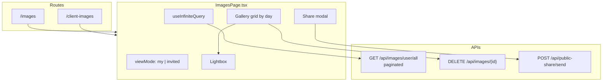

# Images Page — Upload API & Gallery

This document covers:

1. **Simple image upload API** — request payload only (`POST /api/images/upload`)
2. **`ImagesPage.tsx`** — how images are fetched, filtered, and displayed

**Related files**

| File | Role |
|------|------|
| `` | Gallery UI (routes: `/images`, `/client-images`) |
| `` | Upload queue + `POST /api/images/upload` |
| `src/api/client/axiosInstance.ts` | Axios client, auto `Authorization: Bearer` |
| `docs/FRONTEND_API_REFERENCE.md` | Full API shapes for images & albums |
| `docs/PHOTO-STUDIO-ALBUM-IMAGES.md` | Album page image loading (similar progressive pipeline) |

---

## Table of contents

1. [Simple upload API (payload only)](#1-simple-upload-api-payload-only)
2. [List images API](#2-list-images-api)
3. [ImagesPage overview](#3-imagespage-overview)
4. [Data model](#4-data-model)
5. [Fetch flow](#5-fetch-flow)
6. [Display flow](#6-display-flow)
7. [User actions](#7-user-actions)
8. [Share APIs used by ImagesPage](#8-share-apis-used-by-imagespage)
9. [Quick reference](#9-quick-reference)

---

## 1. Simple upload API (payload only)

Upload a single image (or video) to the **logged-in user's account**.

### Endpoint

```
POST /api/images/upload
```

### Headers

| Header | Value |
|--------|--------|
| `Authorization` | `Bearer <token>` |
| `Content-Type` | `multipart/form-data` |

The web client sets `Content-Type: multipart/form-data` explicitly. Axios also adds the Bearer token from `localStorage.token` unless a custom token is passed.

### Body (multipart form fields)

| Field | Type | Required | Description |
|-------|------|----------|-------------|
| `file` | File (binary) | **Yes** | Image or video file |

**No other fields** are sent for a normal “my account” upload.

### Example (cURL)

```bash
curl -X POST "https://YOUR_API_BASE/api/images/upload" \
  -H "Authorization: Bearer YOUR_TOKEN" \
  -F "file=@/path/to/photo.jpg"
```

### Example (JavaScript)

```javascript
const formData = new FormData();
formData.append('file', file); // File from <input type="file"> or drag-drop

const response = await fetch(`${API_BASE}/api/images/upload`, {
  method: 'POST',
  headers: { Authorization: `Bearer ${token}` },
  body: formData,
});
```

### Response (success)

The frontend reads the new image id from any of these paths:

```json
{
  "id": 14,
  "message": "Image uploaded successfully"
}
```

or

```json
{
  "image": { "id": 14 },
  "message": "Image uploaded successfully"
}
```

or

```json
{
  "imageId": 14
}
```

**Image id extraction (web):** `response.id ?? response.image?.id ?? response.imageId`

### Upload on web

`ImagesPage` does **not** upload directly. The **Upload** button navigates to `/upload` (`UploadFamilyImagesPage`), which calls `POST /api/images/upload` with the payload above.

### Family upload (optional, not used on ImagesPage)

```
POST /api/images/upload-family
```

| Field | Required |
|-------|----------|
| `file` | Yes |
| `familyMemberId` | Yes (target user id) |

---

## 2. List images API

Used by `ImagesPage` to load the gallery.

### Endpoint

```
GET /api/images/user/all
```

### Query parameters

| Param | Type | Required | Default | Description |
|-------|------|----------|---------|-------------|
| `token` | string | Yes | — | API token (own account or inviter token) |
| `page` | number | No | `0` | 0-based page index |
| `size` | number | No | `20` | Page size (`IMAGES_PAGE_SIZE` on web) |
| `connection` | string | No | — | Network hint from `getConnectionHint()` |
| `saveData` | boolean | No | — | Data-saver hint from `getSaveData()` |

### Example

```
GET /api/images/user/all?token=YOUR_TOKEN&page=0&size=20&connection=4g&saveData=false
```

### Response (200)

```json
{
  "totalImages": 45,
  "page": 0,
  "size": 20,
  "totalPages": 3,
  "images": [
    {
      "id": 14,
      "previewUrl": "https://.../api/images/14/preview?token=...",
      "thumbnailUrl": "https://.../api/images/14/thumbnail?token=...",
      "downloadUrl": "https://.../api/images/14/download?token=...",
      "filename": "IMG_001.jpg",
      "fileType": "jpg",
      "uploadTime": "2025-08-25T16:07:16",
      "enabledServices": {
        "googleDrive": "enabled",
        "backblazeB2": "enabled"
      },
      "variants": {
        "s01": "https://...",
        "s03": "https://..."
      }
    }
  ]
}
```

### Delete image

```
DELETE /api/images/{imageId}
```

Auth: Bearer token (header). Only available in **My files** view on the page.

---

## 3. ImagesPage overview



**Component export:** default export is used as both `ImagesPage` and `ClientImagesPage` in `App.tsx`.

| Constant | Value | Purpose |
|----------|-------|---------|
| `IMAGES_PAGE_SIZE` | `20` | Items per API page |
| `ASPECT_RATIO` | `4/3` | Card media ratio |
| `IMAGE_ROOT_MARGIN` | `100px` | IntersectionObserver prefetch margin |
| `SCROLL_RESTORE_KEY` | `photo-studio-images-scroll` | Restore scroll after lightbox |

---

## 4. Data model

### `UserImage` (frontend type)

```typescript
interface UserImage {
  id?: number | string;
  previewUrl: string;
  filename: string;
  downloadUrl: string;
  thumbnailUrl: string;
  enabledServices: { [key: string]: string };
  uploadTime: string;
  fileType: string;
  variants?: ImageVariants; // progressive sizes s01–s10
}
```

### `UserImagesResponse`

```typescript
interface UserImagesResponse {
  totalImages: number;
  images: UserImage[];
  page?: number;
  size?: number;
  totalPages?: number;
}
```

### View modes

| Mode | `viewMode` | Token used | Description |
|------|------------|------------|-------------|
| My files | `'my'` | `localStorage.token` | Current user's images |
| Family / invited | `'invited'` | `selectedUser.inviterApiToken` | View a family member's library |

Query key: `['userImages', selectedUser?.inviterApiToken, viewMode]`

---

## 5. Fetch flow

### 5.1 Infinite query

`useInfiniteQuery` loads pages until `page + 1 >= totalPages`.

```typescript
// Simplified from ImagesPage.tsx
useInfiniteQuery({
  queryKey: ['userImages', selectedUser?.inviterApiToken, viewMode],
  queryFn: async ({ pageParam }) => {
    let token = localStorage.getItem('token');
    if (selectedUser && viewMode === 'invited') {
      token = selectedUser.inviterApiToken;
    }
    const response = await api.get('/api/images/user/all', {
      params: {
        token,
        page: pageParam,
        size: 20,
        connection: getConnectionHint(),
        saveData: getSaveData(),
      },
    });
    return response.data;
  },
  initialPageParam: 0,
  getNextPageParam: (lastPage) => {
    const page = lastPage?.page ?? 0;
    const totalPages = lastPage?.totalPages ?? 1;
    return page + 1 < totalPages ? page + 1 : undefined;
  },
  enabled: !!user && (viewMode === 'my' || (viewMode === 'invited' && !!selectedUser)),
});
```

### 5.2 Deduplication

All pages are flattened, then deduped by:

```
f:{previewUrl}|{filename}|{uploadTime}
```

### 5.3 Variant polling

If any image still needs progressive variants (`variantsNeedPolling`), the query **refetches every 4 seconds** until variants are ready.

### 5.4 Infinite scroll

### 6.2 Gallery card (`ImageCard`)

Each card is memoized and lazy-loaded:

1. **Visibility** — `IntersectionObserver` sets `visibleIndices`; media loads only when visible.
2. **Photos** — `ProgressiveImage` with `mode="thumbnail"`.

Load states per card: `idle` → `loading` → `loaded` | `error` (with retry).

### 6.3 Lightbox

Opened via **View** or card click.

| Feature | Implementation |
|---------|----------------|
| Image source | `useProgressiveImageSrc(..., 'progressive', LIGHTBOX_PROGRESSIVE_OPTIONS)` |
| Live updates | `activeLightboxImage` re-reads from query cache while open (variant polling) |
| Navigation | Prev/Next buttons + Arrow keys |
| Zoom | Mouse wheel, pinch (touch), double-click reset (1×–5×) |
| Pan | Mouse drag when zoomed > 1 |
| Chrome | Filename, date, Share, Download, Close |
| Scroll restore | Saves `window.scrollY` to `sessionStorage` before open |

### 6.4 Loading & error UI

| State | UI |
|-------|-----|
| Initial load | Hero skeleton + 18 card skeletons |
| Fetch error | Error card + **Retry** (`refetch()`) |
| Empty gallery | Empty state + link to `/upload` |

---

---
### Public share URL format

When image ids are known:


## 9. Quick reference

### Upload (minimal)

```
POST /api/images/upload
Authorization: Bearer <token>
Content-Type: multipart/form-data

file = <binary>
```

### List gallery (minimal)

```
GET /api/images/user/all?token=<token>&page=0&size=20
```

### ImagesPage file map

| Area | Lines (approx.) | Description |
|------|-----------------|-------------|
| Types & helpers | 64–255 | `UserImage`, date/format helpers, file type detection |
| `ImageCard` | 275–483 | Grid card, lazy load, progressive thumb |
| `useInfiniteQuery` | 542–582 | Paginated fetch |
| Filters / grouping | 598–653 | Search, date, day groups |
| Lightbox state | 660–1277 | Zoom, pan, keyboard, touch |
| Share modal | 716–926 | Public URL + send |
| Main JSX | 1350–2176 | Header, grid, modals, lightbox |

### See also

- `docs/FRONTEND_API_REFERENCE.md` — §1.2 Get All User Images
- `docs/MOBILE_UPLOAD_ALBUM_PROMPT.md` — upload + add to album flow
- `IMAGE_API_ENDPOINTS.md` — broader image service endpoints
