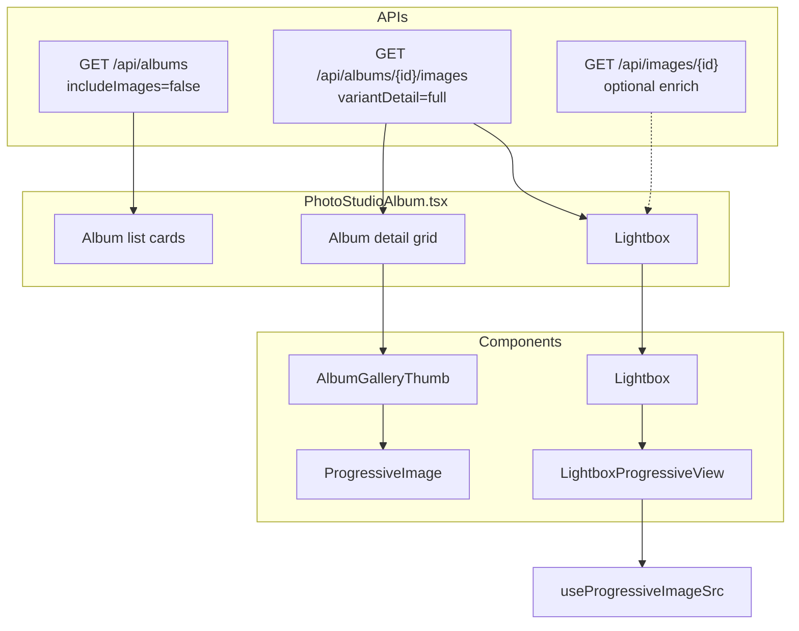
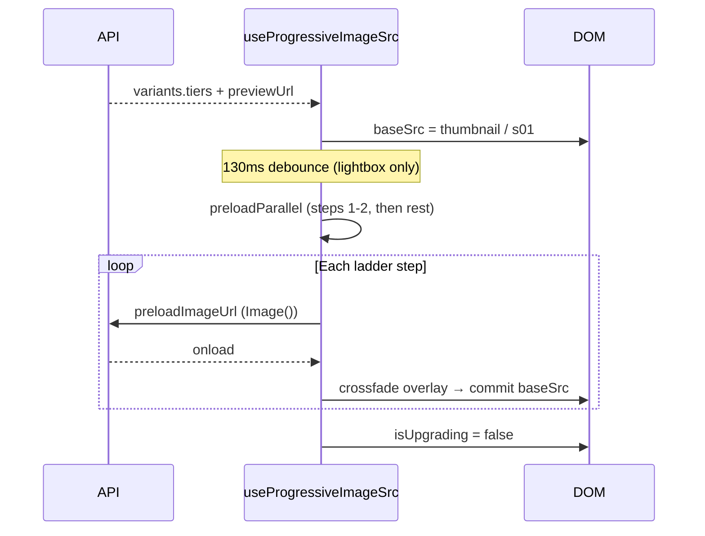

# Photo Studio Album — Image Display Architecture

This document describes **how images are loaded, cached, and displayed** on the Studio Albums page:

- **Route:** `/studio/albums`
- **Main file:** `src/pages/photo-studio/PhotoStudioAlbum.tsx`
- **Related UI:** album list covers, album detail grid, full-screen lightbox, video player

---

## Table of contents

1. [High-level overview](#1-high-level-overview)
2. [Page modes](#2-page-modes)
3. [Data model](#3-data-model)
4. [Backend APIs](#4-backend-apis)
5. [Image variants (s01–s10)](#5-image-variants-s01s10)
6. [Where images appear (3 surfaces)](#6-where-images-appear-3-surfaces)
7. [Album list — cover thumbnails](#7-album-list--cover-thumbnails)
8. [Album detail — photo grid](#8-album-detail--photo-grid)
9. [Lightbox — full-screen view](#9-lightbox--full-screen-view)
10. [Progressive loading pipeline](#10-progressive-loading-pipeline)
11. [Performance & caching](#11-performance--caching)
12. [Photos vs videos](#12-photos-vs-videos)
13. [State & refs reference](#13-state--refs-reference)
14. [File map](#14-file-map)
15. [Tuning guide](#15-tuning-guide)

---

## 1. High-level overview



**Design goals:**

| Goal | How |
|------|-----|
| Fast album list | List API returns metadata + cover only (`includeImages: false`) |
| Fast grid | Lazy thumbnails + variant URLs, not full originals |
| Fast lightbox open | Thumbnails preloaded; first frame is small variant |
| Smooth quality upgrade | Progressive ladder: thumb → s03 → s06 → s09 → original |
| Smooth navigation | Debounced loads; only current image runs full ladder |
| Large albums | Infinite scroll (40 images/page) + lightbox can fetch more |

---

## 2. Page modes

The same component renders two main views controlled by `viewingAlbumId`:

| Mode | `viewingAlbumId` | What user sees |
|------|------------------|----------------|
| **Album list** | `null` | Grid of album cards with cover + name |
| **Album detail** | `number` | Toolbar + photo grid for one album |

Additional overlays:

| Overlay | Trigger | Component |
|---------|---------|-----------|
| **Lightbox** | Click a photo in grid | `Lightbox` + `LightboxProgressiveView` |
| **Video player** | Click a video cell | Native `<video>` modal |
| **Add images modal** | “Add images” | Separate gallery (`ProgressiveImage` thumbnails) |

---

## 3. Data model

### `AlbumImage` (frontend)

Defined in `PhotoStudioAlbum.tsx`. Each row from the album-images API maps to this shape:

| Field | Purpose |
|-------|---------|
| `id` | Primary key |
| `originalFilename` / `filename` | Display name + extension detection |
| `previewUrl` | Full-size preview URL (`/api/images/{id}/preview?token=...`) |
| `thumbnailUrl` | Legacy/fallback thumbnail |
| `downloadUrl` | Download endpoint |
| `fileType` | Optional; usually derived from filename |
| `variants` | **`ImageVariants`** — tier URLs and metadata (critical for progressive UI) |
| `uploadTime` | Grouping photos by day in the grid |

### `ImageVariants` (from API)

See `src/utils/progressiveImageVariants.ts`. Important fields:

```typescript
interface ImageVariants {
  status?: 'processing' | 'partial' | 'ready';
  thumbnailUrl?: string;
  recommendedUrl?: string;
  previewFallbackUrl?: string;
  tiers?: Record<string, { available?: boolean; url?: string; ... }>;
  // tiers keys: s01, s02, … s10
}
```

Variant file URLs look like:

`/api/images/{id}/variant/s01?token=...`

The **original** is typically `previewUrl` (full file via preview endpoint).

### Normalized progressive shape

`toProgressiveImage()` in `src/utils/albumImageVariants.ts` converts `AlbumImage` → `UserImageWithVariants` for hooks/components.

---

## 4. Backend APIs

### Album list (metadata only)

```
GET /api/albums?page=&size=20&includeImages=false&connection=&saveData=
```

- **Used when:** browsing `/studio/albums` (not inside an album).
- **Returns:** album name, counts, cover hints — **not** full photo lists.
- **Why:** Keeps the list API small and fast.

### Album images (full gallery)

```
GET /api/albums/{albumId}/images?page=&size=40&variantDetail=full&connection=&saveData=
```

- **Used when:** user opens an album (`viewingAlbumId` set).
- **`variantDetail=full`:** includes `variants.tiers` with s01–s10 URLs (required for grid + lightbox without extra calls).
- **Pagination:** `page`, `totalPages`, `total` in response.
- **React Query key:** `['albumImages', viewingAlbumId, connection, saveData]`

### Single image enrich (fallback)

```
GET /api/images/{id}?token=&connection=&saveData=
```

- **Used when:** an image in the lightbox is missing `variants.tiers` (legacy or partial payload).
- **Cached in:** `fullVariantCacheRef` (does not re-render the whole grid).

### Variant / preview HTTP caching (backend)

- Variant files: `Cache-Control: private, max-age=604800` (7 days)
- Preview files: same — browser can cache originals after first load

---

## 5. Image variants (s01–s10)

Configured in backend `application.properties`:

```properties
app.image.variants=s01:0.12,s02:0.18,...,s10:0.88
app.image.variants.max-edge-px=1280
```

All tiers share the same max edge (1280px); JPEG quality increases per step.

### Ladder order (frontend)

Built by `getProgressiveLadderUrls()`:

1. Thumbnail (`variants.thumbnailUrl` or smallest tier)
2. `s01` → `s02` → … → `s10` (sorted numerically)
3. `recommendedUrl` (if distinct)
4. **Final:** `previewUrl` / original (when `finalTarget: 'original'`)

### Lightbox subsampling

`LIGHTBOX_PROGRESSIVE_OPTIONS` uses `strategy: 'full'`, `maxSteps: 5`:

~13 URLs are reduced to **5 steps**, e.g. `[thumb, s03, s06, s09, original]`, with **150ms** crossfade each (~600ms to full quality if cached).

---

## 6. Where images appear (3 surfaces)

```
┌─────────────────────────────────────────────────────────────┐
│  ALBUM LIST (/studio/albums)                                │
│  ┌──────┐ ┌──────┐                                          │
│  │ cover│ │ cover│  ← pickAlbumCoverImage + variant thumb   │
│  └──────┘ └──────┘                                          │
└─────────────────────────────────────────────────────────────┘
         │ click album
         ▼
┌─────────────────────────────────────────────────────────────┐
│  ALBUM DETAIL (viewingAlbumId = 123)                         │
│  ┌───┐ ┌───┐ ┌───┐ ┌───┐ ┌───┐                               │
│  │ T │ │ T │ │ T │ │ T │ │ T │  ← AlbumGalleryThumb (lazy)  │
│  └───┘ └───┘ └───┘ └───┘ └───┘                               │
│  [Load more sentinel → fetch page 2, 3, …]                    │
└─────────────────────────────────────────────────────────────┘
         │ click photo
         ▼
┌─────────────────────────────────────────────────────────────┐
│  LIGHTBOX (portal, z-index 9999)                             │
│  Progressive: thumb → … → original                           │
│  Prev/Next + load more at end of loaded set                  │
└─────────────────────────────────────────────────────────────┘
```

---

## 7. Album list — cover thumbnails

### Cover selection (`pickAlbumCoverImage`)

Priority:

1. Explicit `album.coverImageId` if that image is a **photo** (not video)
2. Else first **photo** in the album’s image list
3. Else first photo from API cover fallback
4. **Never** uses a video as the card cover

### URL resolution (`getCoverImageUrl`)

1. `getAlbumThumbnailUrl(coverPhoto)` — variant-aware smallest URL
2. Fallback `getImageUrl(coverPhoto)` (preview)
3. Fallback constructed URL: `/api/images/{id}/thumbnail?token=...`
4. On error → `coverImageErrors` set; shows folder icon

### Rendering

Album cards use a plain `` (not `AlbumGalleryThumb`) because only one small image per card is needed.

List query uses `includeImages: false`; cover may come from `albumImages` Map if that album was opened before, or from summary `images` array (often just cover stub from list API).

---

## 8. Album detail — photo grid

### Opening an album (`openViewingAlbum`)

```typescript
setViewingAlbumId(albumId);
// clears selection, share UI, date filter, etc.
```

This enables the `albumImages` infinite query.

### Loading state (`viewingAlbumDetailPending`)

Shows a **skeleton grid** when:

- `viewingAlbumId` is set, AND
- No images fetched yet, AND
- Query is loading/fetching

Avoids flashing a single cover image before the real grid appears.

### Merging pages

```typescript
viewingAlbumFetchedImages = dedupe(all pages from albumImagesData)
```

Synced into `albumImages` Map for reuse (covers, lightbox).

### Grid cell — photos

Component: **`AlbumGalleryThumb`**

| Prop | Behavior |
|------|----------|
| `image` | `AlbumImage` with `variants` |
| `fileType` | From `getFileTypeFromAlbumImage()` |
| `eager` | `true` for first **30** cells (`viewingAlbumThumbEagerIndex`) |
| lazy | `IntersectionObserver` with `rootMargin: 500px` |

Inside `AlbumGalleryThumb`:

→ `ProgressiveImage` with `mode="thumbnail"`  
→ `useProgressiveImageSrc` shows **one** URL only (`getThumbnailSrc`) — no ladder in grid

### Grid cell — videos

Plain `` or placeholder + play icon overlay; click opens **video modal**, not lightbox.

### Client-side pagination in UI

- `ALBUM_IMAGES_PAGE_SIZE = 40` from API per request
- Grid shows `viewingAlbumDisplayImages` grouped by day
- **Infinite scroll:** sentinel `loadMoreAlbumImagesRef` with `rootMargin: 600px`
- **Auto prefetch:** when page 1 arrives, page 2 is fetched immediately in background

### Thumbnail preload (browser cache)

When `viewingAlbumFetchedImages` updates, the page fires `new Image().src = thumbnailUrl` for every loaded image (`fetchPriority: 'low'`) so the first lightbox open is instant.

---

## 9. Lightbox — full-screen view

### Opening (`openLightbox`)

```typescript
openLightbox(albumId, index, viewingAlbumImageOnly);
```

- Sets `lbAlbumId`, `lbIndex`
- Preloads neighbor thumbnail URLs via `ImagePreloadManager` (index±1, +2 ahead)
- Calls `prefetchLightboxVariants` for current ±1 images

### Building items (`lightboxItems`)

For each photo in `getLightboxImagesForAlbum(lbAlbumId)`:

| Field | Source |
|-------|--------|
| `src` / `thumbnailSrc` | `getAlbumThumbnailUrl` or preview |
| `progressiveImage` | `toProgressiveImage(resolved, fileType)` |
| `resolved` | `fullVariantCacheRef.get(id) ?? img` |

### Rendering (`Lightbox` component)

File: `src/components/lightbox/Lightbox.tsx`

- Portal to `document.body`
- Internal `currentIndex` (navigation does not re-render whole album page)
- If `progressiveImage` set → **`LightboxProgressiveView`**
- Else → `LightboxImage` (simple src swap)

### Progressive view (`LightboxProgressiveView`)

- Uses `useProgressiveImageSrc` with `LIGHTBOX_PROGRESSIVE_OPTIONS`
- **Outgoing layer:** previous image stays visible until new base `onLoad` (no blank flash on fast next/prev)
- **130ms debounce** before starting variant ladder (skipped images don’t download tiers)
- Thin progress bar at bottom while upgrading

### Navigation & load more

| Feature | Implementation |
|---------|----------------|
| Arrow keys / buttons | `Lightbox` internal `goPrev` / `goNext` |
| Near end of list | `maybeLoadMore` → `onLoadMore` |
| Parent handler | `handleLightboxLoadMore` → `fetchMoreAlbumImages()` |
| `totalCount` | `albumImagesApiTotal` from API |
| `hasMoreItems` | `hasMoreAlbumImages` when viewing same album |

`onIndexChange` → debounced `prefetchLightboxVariants` (80ms).

### Variant prefetch (`prefetchLightboxVariants`)

For index, index±1:

- If `variants.tiers` already present → skip
- Else `GET /api/images/{id}` → `cacheVariantForLightbox` → `variantCacheTick++` → `lightboxItems` recomputed

Uses `lightboxVariantInflight` ref to avoid duplicate requests.

---

## 10. Progressive loading pipeline



### Modes (`ProgressiveDisplayMode`)

| Mode | Used in | Behavior |
|------|---------|----------|
| `thumbnail` | Grid (`AlbumGalleryThumb`) | Single smallest URL, no upgrades |
| `progressive` | Lightbox | Full ladder per `LIGHTBOX_PROGRESSIVE_OPTIONS` |

### Strategies (`ProgressiveStrategy`)

| Strategy | Behavior |
|----------|----------|
| `quick` | First + last only |
| `full` / `step-on-load` | Subsampled full ladder |
| `smart` | Ladder + connection-aware caps (not used in lightbox; `connectionAware: false` there) |

Config file: `src/utils/progressiveImageConfig.ts`  
Env override: `REACT_APP_PROGRESSIVE_STRATEGY`

---

## 11. Performance & caching

### React Query

| Query | staleTime | Notes |
|-------|-----------|-------|
| `albums` | 5 min | `refetchOnMount: false` |
| `albumImages` | 2 min | Keyed by album + connection |

### Refs (avoid full page re-renders)

| Ref | Purpose |
|-----|---------|
| `fullVariantCacheRef` | Map imageId → enriched `AlbumImage` |
| `lightboxVariantInflight` | In-flight variant fetches |
| `prefetchLightboxTimer` | Debounce navigate prefetch |
| `page1LoadedRef` | Auto-fetch page 2 once per album |

### ImagePreloadManager

Singleton for lightbox neighbor thumbnail preloads (`preloadNext: 2`, `preloadPrev: 1`).

### Progressive preload cache

`progressiveImagePreload.ts` — module-level `Set` of loaded URLs; parallel preloads share promises.

### Navigation discipline

- Rapid next/prev: **130ms debounce** before ladder starts → skipped slides don’t fire tier downloads
- Lightbox neighbor preload: **100ms debounce**
- Outgoing image held until new image `onLoad` → no blank frame

---

## 12. Photos vs videos

| Type | Detection | Grid | Full screen |
|------|-----------|------|-------------|
| Photo | Extension in `IMAGE_EXTENSIONS` | `AlbumGalleryThumb` | `Lightbox` + progressive |
| Video | `VIDEO_EXTENSIONS` | Thumb + play icon | `<video>` modal |

`viewingAlbumImageOnly` = photos only → used for lightbox index and arrow navigation.

Album list covers: **photos only** (`pickAlbumCoverImage`).

---

## 13. State & refs reference

### Core state

| State | Type | Role |
|-------|------|------|
| `viewingAlbumId` | `number \| null` | Album list vs detail |
| `albumImages` | `Map<albumId, AlbumImage[]>` | Cached images per album |
| `lbAlbumId` | `number \| null` | Lightbox open for which album |
| `lbIndex` | `number` | Initial slide index |
| `variantCacheTick` | `number` | Force `lightboxItems` refresh after variant fetch |
| `viewingVideo` | `AlbumImage \| null` | Video modal |

### Key memos

| Memo | Role |
|------|------|
| `viewingAlbumFetchedImages` | Flattened infinite query pages |
| `viewingAlbumImageOnly` | Photos for lightbox |
| `viewingAlbumPhotosByDay` | Grid grouping |
| `lightboxItems` | `LightboxItem[]` for portal |

### Constants

```typescript
const ALBUMS_PAGE_SIZE = 20;
const ALBUM_IMAGES_PAGE_SIZE = 40;  // API page size
// First 30 grid cells: eager=true on AlbumGalleryThumb
```

---

## 14. File map

| File | Responsibility |
|------|----------------|
| `src/pages/photo-studio/PhotoStudioAlbum.tsx` | Page logic, queries, grid, lightbox wiring |
| `src/components/photo-studio/AlbumGalleryThumb.tsx` | Lazy grid cell + thumbnail mode |
| `src/components/photo-studio/ProgressiveImage.tsx` | `` + optional overlay crossfade |
| `src/components/lightbox/Lightbox.tsx` | Full-screen shell, nav, load more |
| `src/components/lightbox/LightboxProgressiveView.tsx` | Progressive full-screen image |
| `src/components/lightbox/LightboxImage.tsx` | Fallback non-progressive slide |
| `src/hooks/useProgressiveImageSrc.ts` | Ladder, debounce, crossfade logic |
| `src/utils/albumImageVariants.ts` | `getAlbumThumbnailUrl`, `toProgressiveImage` |
| `src/utils/progressiveImageVariants.ts` | Ladder URLs, tier ordering |
| `src/utils/progressiveImageConfig.ts` | `LIGHTBOX_PROGRESSIVE_OPTIONS` |
| `src/utils/progressiveImagePreload.ts` | Image() preload cache |
| `src/utils/imagePreloader/ImagePreloadManager.ts` | Neighbor preload for lightbox |

Backend:

| File | Responsibility |
|------|----------------|
| `AlbumService.getAlbumImagesPage` | Paginated images + batched variants |
| `ImageVariantService.buildVariantsMapForApi` | Builds `variants` JSON |
| `ImageController` variant/preview endpoints | Serves JPEG bytes + cache headers |

---

## 15. Tuning guide

### Faster grid first paint

- Increase `eager` count on `AlbumGalleryThumb` (currently 30)
- Reduce `ALBUM_IMAGES_PAGE_SIZE` if API is slow (tradeoff: more requests)

### Faster lightbox to “original”

- Lower `maxSteps` in `LIGHTBOX_PROGRESSIVE_OPTIONS` (fewer crossfades)
- Lower `crossfadeMs` (snappier but more visible steps)
- Ensure `variantDetail=full` on album images API (avoids per-image `GET /api/images/{id}`)

### Slower networks

- Set `REACT_APP_PROGRESSIVE_STRATEGY=quick` globally, or use `smart` with `connectionAware: true`
- Backend `connection` + `saveData` query params already passed from `getConnectionHint()`

### Less bandwidth on navigation

- Increase lightbox debounce in `useProgressiveImageSrc` (130ms → 200ms)
- Reduce `PRELOAD_NEXT` in `Lightbox.tsx`

---

## Quick reference: click → network

| User action | Network |
|-------------|---------|
| Land on `/studio/albums` | `GET /api/albums?page=0` |
| Open album | `GET /api/albums/{id}/images?page=0&variantDetail=full` (+ auto page 1) |
| Scroll grid | Next pages via intersection observer |
| Click photo | No new API if variants present; thumbnails already preloaded |
| Lightbox upgrades | `GET` variant URLs s01…s10 + preview (browser cache after first view) |
| Arrow to photo without tiers | `GET /api/images/{id}` once, then cached |
| Arrow near end | `fetchMoreAlbumImages` if more pages exist |

---

*Last updated to match `PhotoStudioAlbum.tsx` and related image utilities in the FileVault-FrontEnd repo.*
