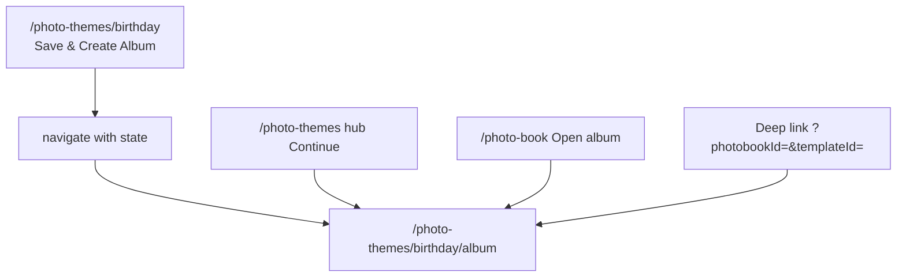
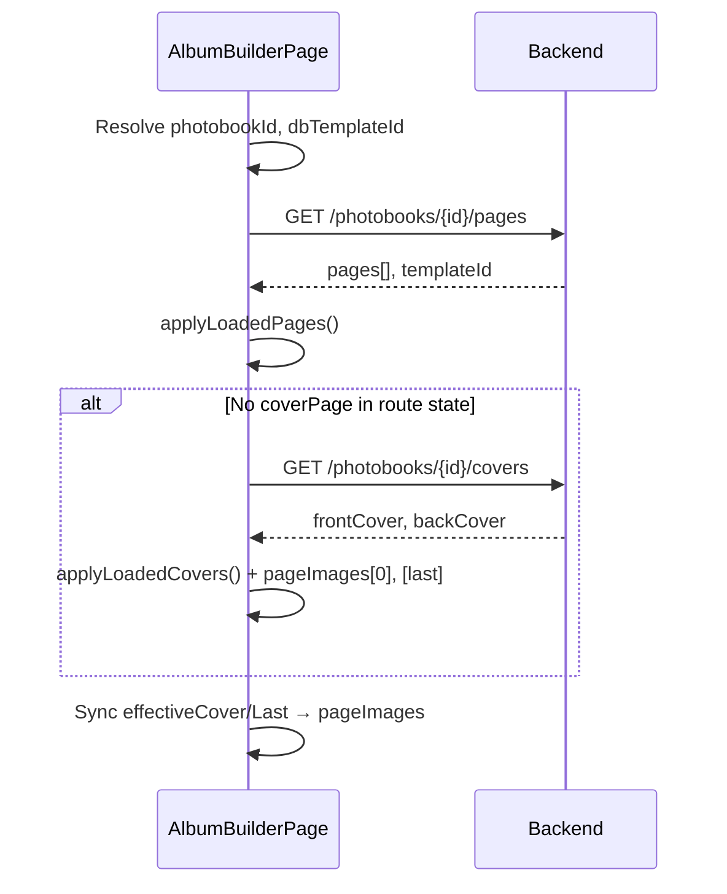

# Photo Theme Album Builder — `/photo-themes/:categorySlug/album`

Dedicated reference for the **multi-page photobook editor** only.

**Example:** `http://localhost:3000/photo-themes/birthday/album`

| Item | Value |
|------|--------|
| **Route** | `photo-themes/:categorySlug/album` |
| **Component** | `PhotoThemeAlbumBuilderPage` |
| **Source file** | `src/pages/photo-themes/PhotoThemeAlbumBuilderPage.tsx` (~4,787 lines) |
| **Layout** | Main app `Layout` (sidebar + header) via `src/App.tsx` |
| **i18n namespace** | `photoThemeAlbumBuilderPage.*` (`en.json` / `hi.json`) |

---

## 1. What this page does

After the user designs **front + back covers** on `/photo-themes/birthday`, this page is where they:

1. Build **6–18 pages** (cover + inner spreads + last page).
2. Pick a **layout per page** (1–6 photo slots).
3. Assign photos from **FileVault** or a **linked Photo Studio album**.
4. Edit **cover/back text** inline (without leaving the builder).
5. **Save** page data to `POST /api/photobooks/{id}/pages`.
6. **Preview** as a 3D-style flip book (`react-pageflip`).
7. **Export** PDF, per-page ZIP, Base64 JSON, or HTML flipbook.

For **birthday**, the UI template id is `birthday` (from `pickTemplateIdForCategory`), which loads spreads from `src/templates/photobookTemplates.ts` (`getPhotoBookTemplate('birthday')`).

---

## 2. How users arrive here



### Required context (at least one)

| Source | Fields |
|--------|--------|
| **React Router `location.state`** | `photobookId`, `dbTemplateId` or `templateId`, optional `coverPage`, `lastPage`, `albumImageIds`, `albumName`, `openPreview` |
| **Query string** | `?photobookId=123&templateId=45` |
| **localStorage** | `photobook_birthday` → `{ templateId, photobookId }` |
| **sessionStorage** | `studioAlbum_birthday` → `{ imageIds, albumName }` |
| **sessionStorage** | `photoTheme_cover_last_birthday` → trimmed cover/last snapshot |

Without `photobookId` + `dbTemplateId`, the page tries to **recover** the latest book via `GET /api/photobooks/by-category/birthday` or creates one on **Save**.

---

## 3. Imports — external packages

| Package | Used for |
|---------|----------|
| `react` | Component, hooks, `forwardRef` |
| `react-dom` / `createPortal` | Modals (flip book, picker, toasts, layout creator, export progress) mounted on `document.body` |
| `react-router-dom` | `useParams`, `useNavigate`, `useLocation`, `useSearchParams` |
| `react-i18next` | `useTranslation({ keyPrefix: 'photoThemeAlbumBuilderPage' })` |
| `i18next` / `TFunction` | Default cover copy builders |
| `react-pageflip` / `HTMLFlipBook` | Full-screen flip preview |
| `jspdf` | PDF export |
| `jszip` | ZIP export of rendered page JPEGs |
| `@dnd-kit/core` | `DndContext`, `useDraggable`, `useDroppable`, `PointerSensor` — slot drag-to-swap in bottom strip |
| `react-icons/fa` | Toolbar, library, buttons |

---

## 4. Imports — project modules

| Import path | What it provides | How this page uses it |
|-------------|------------------|------------------------|
| `../../templates/photobookTemplates` | `getPhotoBookTemplate`, `photobookTemplates` | `pickTemplateIdForCategory('birthday')` → `'birthday'` → default spreads & layout names for `basePages` |
| `../../components/PhotoBook/FileVaultImagePicker` | Modal grid of user images + upload | Portal modal when `pageImagePickerFor` is set; `filterImageIds` when studio album linked |
| `./PhotoThemeCategoryPage` | `EditablePageState`, `getDescriptionTypographyStyle` | Cover/last text editing; same type as cover editor; description typography on text leaves |
| `../../api/client/axiosInstance` | `api` | All photobook REST calls |
| `../../api/services/imageService` | `uploadImage(file)` | Upload `data:` URLs before save |
| `../../state/context/AuthContext` | `useAuth()` → `user.id` | Gate save/load |
| `../../utils/authUtils` | `getStoredToken()` | `X-API-KEY` header + `?token=` on image URLs |
| `src/components/PhotoBook/ModernAlbumImageLibrary` | Sidebar library UI | **Imported but not used** — left sidebar is implemented inline in this file |

---

## 5. Module-level helpers (same file)

These are **not** separate files; they live at the top of `PhotoThemeAlbumBuilderPage.tsx`.

| Symbol | Role |
|--------|------|
| `getApiBaseForAssets()` | API origin for `` |
| `appendPreviewToken(url)` | Appends auth token to preview URLs |
| `buildPreviewUrl(imageId)` | `/api/images/{id}/preview?token=…` |
| `resolveImageUrl(url)` | Normalizes relative/API paths to absolute preview URLs |
| `COVER_DECAL_SVGS` | Inline SVG data URLs (cake, rings, heart, balloon, star) for cover presets |
| `buildThemeDefaultCover(slug, t)` | Birthday → “Happy Birthday” + cake decal |
| `buildThemeDefaultLast(slug, t)` | “The End” / thank-you back cover |
| `buildMinimalPresetCover(t)` | Minimal cover preset |
| `extractImageIdFromUrl(url)` | Parse FileVault image id from URL |
| `PAGE_LAYOUT_CONFIG` | All layout ids, slot counts, arrangements |
| `LAYOUT_GEOMETRY` | Percent-based slot rectangles per layout id |
| `LAYOUT_SHORT_TKEY` | Maps layout id → i18n key |
| `getArrangementForLayoutId` / `getSlotCountForLayoutId` | Layout rendering |
| `pickTemplateIdForCategory(slug)` | `birthday` \| `festival` → template `birthday`; `wedding` → `wedding`; etc. |
| `getStoredCoverLast` / `setStoredCoverLast` | sessionStorage cover backup |
| `mergeCoverLeafStyleFromApi` | Maps API cover JSON → text-leaf glass fields |
| `dataUrlToFile` / `fileToDataUrl` | Upload pipeline |
| `hexToRgbaAlbum` | Glass panel color |

---

## 6. Internal React components (same file)

| Component | Purpose |
|-----------|---------|
| **`FlipBookPage`** | `forwardRef` wrapper required by `react-pageflip` for each page child |
| **`DraggableCropImage`** | Photo in slot with drag-to-reposition (`object-position`); used in canvas + PDF render path |
| **`LayoutOptionThumb`** | Layout picker thumbnail — shows current page images in layout geometry or placeholders |
| **`AlbumSlotCard`** | 88×88 slot in bottom filmstrip: draggable when filled, droppable, click empty → picker, remove × |
| **`PhotoThemeAlbumBuilderPage`** | Main export (default) |

---

## 7. Core types

```typescript
type AlbumPage = {
  index: number;
  type: 'cover' | 'inner' | 'last';
  layoutName: string;           // from photobook template spread
  coverSplit?: 'text' | 'image'; // flip-book only
};

type PageImageState = {
  imageDataUrl?: string;
  imageDataUrls?: string[];     // multi-slot layouts
  imageIds?: number[];          // FileVault ids (avoid re-upload)
  layout?: string;              // overrides layoutName for this page
  frameStyle?: FloralFrameStyle;
  cropPositions?: Record<number, { x: number; y: number }>;
  slotCaptions?: Record<number, string>;
};

type FloralFrameStyle =
  | 'none' | 'rose-floral-side' | 'maroon-gold-wedding' | 'pink-soft-romantic'
  | 'green-leaf-border' | 'royal-heavy-floral' | 'minimal-corner-flower'
  | 'full-floral-border' | 'heart-flower-combo';
```

**Cover text** uses `EditablePageState` imported from `PhotoThemeCategoryPage` (`effectiveCover`, `effectiveLast`).

---

## 8. State variables (main component)

### Identity & routing

| State | Initial / source |
|-------|------------------|
| `categorySlug` | `useParams` → `birthday` |
| `dbTemplateId` | state → query → `localStorage photobook_birthday` |
| `photobookId` | state → query → localStorage → API recover |
| `studioAlbumImageIds` | `location.state.albumImageIds` → `sessionStorage studioAlbum_birthday` |
| `studioAlbumName` | Same session key |

### Page structure

| State | Purpose |
|-------|---------|
| `pageCount` | 6–18 total pages |
| `albumPages` | Computed list: cover + inners + last |
| `flipBookAlbumPages` | Cover/last each split into **text** + **image** leaf for flip UI |
| `pageImages` | `Record<pageIndex, PageImageState>` — all slot photos/crops/captions |
| `pageLayouts` | Per-page layout id override |
| `currentStep` | Index of page being edited (0 … n-1) |

### Cover / last (text + photo authority)

| State | Purpose |
|-------|---------|
| `effectiveCover` | Front cover `EditablePageState` (from navigation or API) |
| `effectiveLast` | Back cover `EditablePageState` |

### Editor UI

| State | Purpose |
|-------|---------|
| `canvasZoom` | 50–130% canvas scale (S/M/L presets) |
| `layoutQuickFilter` | Filter layouts by slot count: `all` \| `1`–`6` |
| `pendingLibraryImage` | Left sidebar: selected thumb before applying to slot |
| `librarySearch` / `libraryFilter` | Filter left library grid |
| `pageImagePickerFor` | Opens `FileVaultImagePicker` modal |
| `customLayouts` / `showLayoutCreator` | User-defined slot geometry |
| `layoutStudioSlots`, `layoutStudioBg`, … | Layout creator studio UI |

### Theme chrome (category-specific)

| State | When visible |
|-------|----------------|
| `selectedColorTheme` | `categorySlug === 'anniversary'` — romantic gradient backgrounds |
| `selectedWeddingBackground` | `categorySlug === 'wedding'` — ivory, blush, gold, etc. |

**Birthday** does not show extra theme pickers in the right rail (uses default white/page backgrounds unless frame styles applied).

### Preview & export

| State | Purpose |
|-------|---------|
| `showFlipBook` | Full-screen flip modal |
| `showSinglePageView` | Single-page slideshow modal |
| `flipBookPage`, `flipBookRef` | Current flip index + PageFlip API |
| `bookOrientation` | `landscape` \| `portrait` |
| `slideshowActive`, `slideshowSpeed`, `isZoomed` | Single-page view |
| `isGeneratingPdf` / `Zip` / `Flipbook` / `Base64` | Export locks |
| `pdfProgress` | `{ current, total }` while rendering pages |

### Save / load

| State | Purpose |
|-------|---------|
| `isLoading` | Full-screen restore overlay |
| `isSaving`, `saveError`, `saveSuccess` | Save + toast portal |

---

## 9. Birthday template mapping

```typescript
// pickTemplateIdForCategory('birthday') → 'birthday'
const template = getPhotoBookTemplate('birthday');
```

From `photobookTemplates.ts`, birthday default spreads include layouts such as:

- `cover-birthday-spotlight` (cover)
- `birthday-hero-plus-two`, `birthday-collage-6`, `birthday-strip-4`, `birthday-four-grid` (inner)
- Back spread uses `birthday-strip-4`

The editor maps these to **display layouts** via `PAGE_LAYOUT_CONFIG` (often defaults inner pages to **Single Photo** unless saved layout on API says otherwise).

Default cover copy when nothing saved:

- Headline: “Happy Birthday”
- Sub: “Celebrate the moment”
- Decal: cake SVG (`COVER_DECAL_SVGS.cake`)

---

## 10. Load sequence (on mount)



**Important:** If `photobookId` exists, the page **does not** call legacy `/api/album-pages?userId&templateId` (would mix another book’s pages). Only photobook-scoped load.

---

## 11. Save sequence (`handleSaveAlbum`)

1. Validate `user.id`.
2. Resolve `dbTemplateId` (GET photobook if needed).
3. **POST** `/api/photobooks` if no `photobookId`.
4. For each `albumPages` entry:
   - Build `imageIds[]` per slot (keep FileVault ids; upload `data:` URLs via `imageService.uploadImage`).
   - Serialize `cropPositions`, `slotCaptions` as JSON strings.
   - Set `layout`, `frameStyle`, `pageType`, `pageNumber`.
5. **POST** `/api/photobooks/{id}/pages` with `{ pages, pageCount, colorTheme, weddingBackground }`.
6. **PUT** `/api/photobooks/{id}` — `currentStep: 'ALBUM'`, `status: 'IN_PROGRESS'`.
7. Toast: “Album saved!”

Cover/last **text** is stored via cover endpoints on the category page; this save focuses on **page slots**. Cover/last **photos** sync from `effectiveCover` / `effectiveLast` into `pageImages` before render/save.

---

## 12. UI layout — screen regions

### A. Loading overlay (`isLoading`)

- Fixed full screen, white blur, indigo spinner.
- Copy: `loadingAlbum` / `restoringPages`.

### B. Studio album banner (optional)

- Shown when `studioAlbumImageIds` is set.
- Indigo gradient bar: album name + “N images available”.
- Left library only shows those image ids when picking.

### C. Sticky top bar (`no-print`)

| Control | Action |
|---------|--------|
| ← Back | `navigate(/photo-themes/birthday, { state: { templateId, photobookId } })` |
| Title | `studioAlbumName` or template name + page count |
| Progress bar | % pages with at least one image |
| Preview | Opens flip book modal |
| Save | `handleSaveAlbum` |
| Export | `handleDownloadPdf` (header); more formats inside flip modal |
| Undo/Redo | Disabled placeholders |

### D. Three-column workspace (`md:flex-row`)

#### Left sidebar — Photo library (`hidden md:flex`, w-56–64)

- Search input (`searchPhotos`).
- Filter chips: `all` / `recent`.
- Scrollable 2-column grid (up to 40 thumbs from `libraryPhotoUrls`).
- Tap image → `pendingLibraryImage`; then tap slot on canvas to apply.
- **Add from library** → opens picker for current page.

`libraryPhotoUrls` built from:

- Studio album image ids → `buildPreviewUrl(id)`, or
- User images API (when no studio filter).

#### Center — Album canvas

- Page badge: **Cover** (amber) / **Page N** / **Back** (stone).
- Zoom: S / M / L + − / + and percentage.
- **Layout picker**: horizontal scroll of `LayoutOptionThumb` (filtered by `layoutQuickFilter`).
- **Page preview card**: 4:3-style area; `renderPageInner(page, 'preview', { editable: true })` — real arrangement grid, `DraggableCropImage`, floral frames, anniversary/wedding backgrounds.
- **Custom layout creator** (portal): drag-resize slots, save as new layout id.

#### Right sidebar — Layout & settings

- Photo count filter (all, 1–6 slots).
- Page layout list (same options as center).
- **Theme** section (anniversary colors / wedding backgrounds only).
- **Captions** (inner pages only): per-slot text inputs.
- **Cover text panel** (cover & last only):
  - Title, subtitle, description fields.
  - Font size, alignment, vertical align.
  - Link: “Edit in Cover Editor” → `/photo-themes/birthday`.
- Background controls for inner pages where applicable.

### E. Bottom page stepper

- Horizontal scroll of page thumbnails (cover / numbered / back).
- Active page: `data-active-step="true"` (auto scroll into view).
- **Add page** / **Delete page** (within min/max limits).
- Prev/Next page buttons + keyboard ←/→ (when not in input).

### F. Bottom slot strip (multi-slot pages)

- `DndContext` + row of `AlbumSlotCard` (88px).
- Drag filled slot onto another to **swap** images.
- **Add photo** opens `FileVaultImagePicker`.

---

## 13. `renderPageInner` — single renderer for everything

One function drives:

- Editor canvas (editable crops),
- Flip book pages,
- Single-page view,
- PDF / ZIP / Base64 pipeline (`renderAllPagesToDataUrls`).

**Cover/last split logic:**

| `coverSplit` | Renders |
|--------------|---------|
| `text` | Glass panel, headline/subheadline/description, text-leaf gradient/image, overlays |
| `image` | Full-bleed photo (+ optional blur/scale from cover style) |
| (undefined) | Normal inner layout grid |

---

## 14. Modals (via `createPortal`)

| Modal | Trigger | Contents |
|-------|---------|----------|
| **Flip book** | Preview / `openPreview: 'flip'` | Dark fullscreen, `HTMLFlipBook`, orientation toggle, export buttons, page dots |
| **Single page view** | Export menu / `openPreview: 'page'` | Large page, slideshow, zoom |
| **FileVaultImagePicker** | Slot click / add photo | Single or multi select; `filterImageIds` for studio album |
| **Layout creator** | Custom layout flow | Slot geometry editor |
| **Export progress** | PDF/ZIP/etc. | Progress text `renderingPage` |
| **Save toast** | saveError / saveSuccess | Top-right fixed |

---

## 15. Export functions

| Handler | Output | Library |
|---------|--------|---------|
| `handleDownloadPdf` | Multi-page PDF | `jspdf` + canvas render |
| `handleDownloadImagesZip` | `page-1.jpg`, … | `jszip` |
| `handleDownloadBase64` | `{ base64: [...] }` JSON file | — |
| `handleDownloadFlipbook` | Standalone HTML flipbook | Generated HTML string |

All use `renderAllPagesToDataUrls` to rasterize each logical page (including cover text/image leaves in flip sequence).

---

## 16. Keyboard & accessibility

| Context | Keys |
|---------|------|
| Editor | ←/→ change `currentStep` (when focus not in input) |
| Single-page view | ←/→ pages; Space play/pause; Z zoom; Esc close |
| Flip book | ←/→ flip (also on-screen chevrons) |
| Escape | Close topmost modal |

Inputs inside cover text panel do not trigger page navigation.

---

## 17. API endpoints used (this page only)

| Method | Endpoint | When |
|--------|----------|------|
| GET | `/api/photobooks/{id}` | Resolve `templateId` from id only |
| GET | `/api/photobooks/by-category/{slug}` | Recover latest book |
| POST | `/api/photobooks` | Create book on save if missing |
| GET | `/api/photobooks/{id}/pages` | Load all pages |
| POST | `/api/photobooks/{id}/pages` | Save all pages |
| PUT | `/api/photobooks/{id}` | Update step/status |
| GET | `/api/photobooks/{id}/covers` | Load cover/back if not in route state |
| GET | `/api/album-pages?userId&templateId` | **Legacy fallback** only when no `photobookId` |
| GET | `/api/photobook-templates` | Resolve template id from slug |
| GET | `/api/images/{id}/preview` | All thumbnails |
| POST | (via `imageService`) | Upload new binary from data URL |

Headers: `X-API-KEY: <token>` from `getStoredToken()`.

---

## 18. Storage keys (birthday example)

| Key | Storage | Content |
|-----|---------|---------|
| `photobook_birthday` | localStorage | `{ templateId, photobookId }` |
| `studioAlbum_birthday` | sessionStorage | `{ imageIds, albumName }` |
| `photoTheme_cover_last_birthday` | sessionStorage | Trimmed `coverPage` / `lastPage` |

---

## 19. Page layouts available (editor)

From `PAGE_LAYOUT_CONFIG` (slot counts):

| Slots | Layout ids (examples) |
|-------|------------------------|
| 1 | Single Full Bleed, Cinematic Love, Single Photo, Cinematic Spread |
| 2 | Love Side by Side, Bride & Groom, Two Up |
| 3 | Hero + Memories, Three Grid, Romantic Collage, Collage, Hero + Two |
| 4 | Wedding Grid, Four Grid, Memory Collage, Luxury Cover, Cinematic Inner |
| 5 | Hero Wedding Story |
| 6 | Memories Spread |

User **custom layouts** append to this list for the session (stored in `customLayouts` state only until saved in page `layout` field).

---

## 20. Floral frame styles (optional per page)

Decorative CSS frames around slots: `rose-floral-side`, `maroon-gold-wedding`, `pink-soft-romantic`, etc. Selected in right/center UI for inner pages; persisted in save payload as `frameStyle`.

---

## 21. i18n

All visible strings use `t('photoThemeAlbumBuilderPage.*')` — see `src/locales/en.json` from line ~3123.

Groups:

- Toolbar: `save`, `export`, `preview`, `pagesCount`, …
- Library: `photoLibrary`, `searchPhotos`, `addFromLibrary`, …
- Layout: `pageLayout`, `layoutFullBleed`, …
- Cover panel: `coverTextPanel`, `fieldTitle`, `presetBirthday`, …
- Flip modal: `flipBook`, `landscape`, `portrait`, `pdf`, `imagesZip`, …
- Errors: `errLoginFirst`, `errTemplateUnknown`, `errSaveAlbum`, …

---

## 22. Related files (not this route, but coupled)

| File | Relationship |
|------|----------------|
| `PhotoThemeCategoryPage.tsx` | Previous step; defines `EditablePageState`; saves covers |
| `PhotoThemesPage.tsx` | Hub; resume into album when `currentStep` is ALBUM |
| `photobookTemplates.ts` | Default spread names for `birthday` |
| `FileVaultImagePicker.tsx` | Image selection modal |
| `PhotoBookPage.tsx` | Can navigate here with `openPreview` |
| `docs/PHOTOTHEME_ALBUM_BUILDER_SPEC.md` | Future UI upgrade notes |
| `docs/PHOTO-THEMES.md` | Full 3-route overview |

---

## 23. Birthday manual test checklist

1. Complete cover save on `/photo-themes/birthday` → lands on `/photo-themes/birthday/album` with `photobookId` in state.
2. Studio banner appears if opened from studio album with `albumImageIds`.
3. Left library shows filtered images; pick + apply to page 2 slot.
4. Change layout to “Four Grid”; add 4 photos.
5. Edit cover title in right **Cover text** panel; preview flip — text leaf shows new title.
6. Save → network shows `POST .../pages` and `PUT .../photobook`.
7. Refresh page → pages and photos restore from API.
8. Export PDF → all pages render without broken images.
9. Back arrow → returns to `/photo-themes/birthday` with same `photobookId`.

---

## 24. Implementation notes for developers

1. **`ModernAlbumImageLibrary`** is imported but unused; the inline left sidebar duplicates similar behavior. Safe to wire up or remove import.
2. **`getPageLayoutLabel`** defaults to `'Single Photo'` when no per-page layout saved — API `layout` field overrides.
3. **Flip page count** ≠ editor page count: cover + last each add an extra leaf (text + image).
4. **Cover photos** on index `0` and last index sync from `effectiveCover` / `effectiveLast`, not only from pages API.
5. **Do not** load `/api/album-pages` when `photobookId` is known — prevents wrong book merge.

---

*Document scope: `PhotoThemeAlbumBuilderPage` only — `/photo-themes/:categorySlug/album` (e.g. birthday). Last updated May 2026.*
