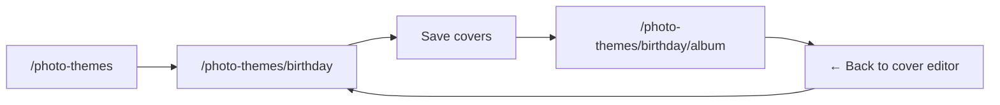
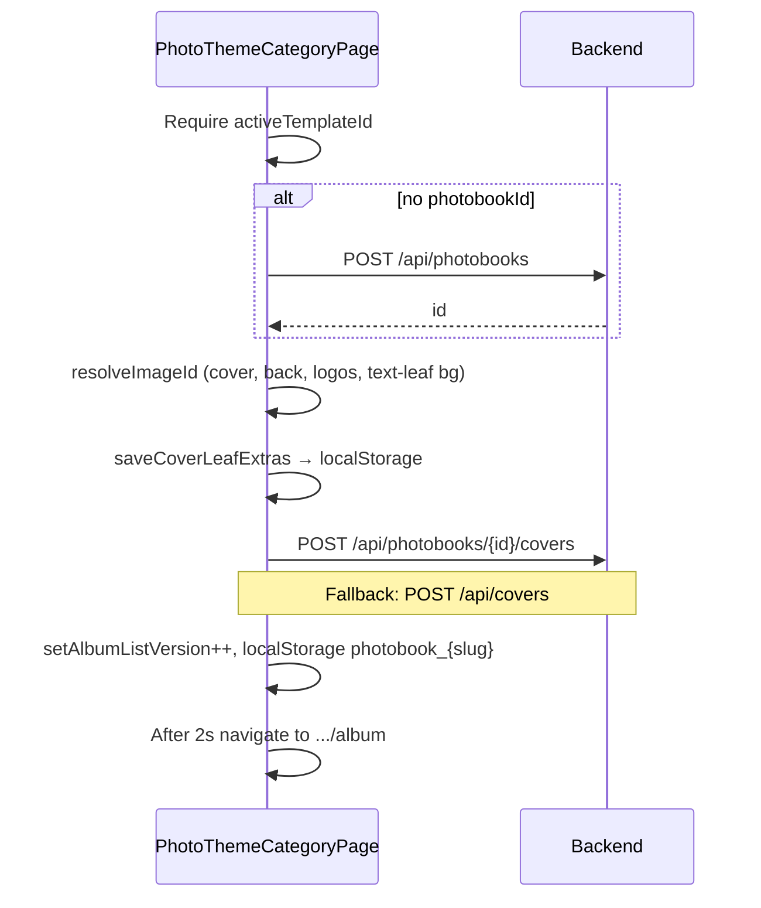

# Photo Theme Category (Cover Editor) — `/photo-themes/:categorySlug`

**Full reference** for `PhotoThemeCategoryPage.tsx` — front & back cover design before the album builder.

| | |
|---|---|
| **Example URL** | `http://localhost:3000/photo-themes/birthday` |
| **Route** | `photo-themes/:categorySlug` (`App.tsx` inside protected `Layout`) |
| **Component** | `PhotoThemeCategoryPage` |
| **Source** | `src/pages/photo-themes/PhotoThemeCategoryPage.tsx` (~3,139 lines) |
| **i18n** | `photoThemeCategoryPage.*` in `src/locales/en.json` / `hi.json` |
| **Next step** | `/photo-themes/:categorySlug/album` (`PhotoThemeAlbumBuilderPage`) |

**Exports used by album builder:**

- `EditablePageState`
- `TextSideOverlay`
- `getDescriptionTypographyStyle()`

---

## Table of contents

1. [Purpose & user journey](#1-purpose--user-journey)
2. [How users arrive (navigation & state)](#2-how-users-arrive-navigation--state)
3. [Page layout (top → bottom)](#3-page-layout-top--bottom)
4. [Hero header (dynamic by slug)](#4-hero-header-dynamic-by-slug)
5. [My Albums section](#5-my-albums-section)
6. [Cover editors (`PageEditorCard`)](#6-cover-editors-pageeditorcard)
7. [Save flow & banners](#7-save-flow--banners)
8. [Data model (`EditablePageState`)](#8-data-model-editablepagestate)
9. [Flip-book preview model](#9-flip-book-preview-model)
10. [Modals & image picker](#10-modals--image-picker)
11. [Persistence (localStorage / sessionStorage)](#11-persistence-localstorage--sessionstorage)
12. [API reference](#12-api-reference)
13. [Module helpers](#13-module-helpers)
14. [React state (main page)](#14-react-state-main-page)
15. [User actions matrix](#15-user-actions-matrix)
16. [Complete i18n key catalog](#16-complete-i18n-key-catalog)
17. [Theme metadata by `categorySlug`](#17-theme-metadata-by-categoryslug)
18. [Design tokens & styling](#18-design-tokens--styling)
19. [Birthday walkthrough](#19-birthday-walkthrough-httplocalhost3000photo-themesbirthday)
20. [Manual test checklist](#20-manual-test-checklist)
21. [Developer notes & edge cases](#21-developer-notes--edge-cases)
22. [Related files & docs](#22-related-files--docs)

---

## 1. Purpose & user journey

This page is the **cover design studio** for one photobook category (e.g. Birthday):

1. See **My Albums** in this category (draft / in progress / completed).
2. Design **front cover** and **back cover** (closing page) with a **live 3:4 preview**.
3. Match the **album flip-book**: text on frosted glass (leaf 1) + full-bleed photo (leaf 2).
4. **Save** covers to the API (create or update photobook).
5. Auto-redirect to the **multi-page album builder** after ~2 seconds.



---

## 2. How users arrive (navigation & state)

### Entry paths

| From | How | `location.state` |
|------|-----|------------------|
| Photo Themes hub | **Start Album** / **Continue** (step `COVER`) | `{ templateId, photobookId? }` |
| Album builder | Back / “Edit in Cover Editor” | `{ templateId, photobookId }` |
| Photo Studio album | Deep link with album photos | `{ templateId, albumImageIds, albumName? }` |

### Router `location.state` fields

| Field | Type | Purpose |
|-------|------|---------|
| `templateId` | `number` | DB template id from `GET /api/photobook-templates` |
| `photobookId` | `number` | Load/save covers for existing book |
| `albumImageIds` | `number[]` | Restrict `FileVaultImagePicker` to studio album images |
| `albumName` | `string` | Stored in session for album builder context |

### Hub behavior (important)

When user clicks **Start Album** on `/photo-themes`, `PhotoThemesPage` **removes** `localStorage` key `photobook_{slug}` so this page opens with **blank** headline/subheadline/images — not pre-filled theme titles.

---

## 3. Page layout (top → bottom)

Visual order on screen (`<div className="space-y-8 w-full">`):

```
┌─────────────────────────────────────────────────────────────┐
│  HERO — indigo → purple → pink gradient, theme icon + title │
├─────────────────────────────────────────────────────────────┤
│  MY ALBUMS — white card, grid of album cards, [New Album]   │
├─────────────────────────────────────────────────────────────┤
│  (optional) Blue banner — "Loading saved covers..."       │
├─────────────────────────────────────────────────────────────┤
│  Status chip — "Editing Album #N" / "Creating new album"    │
├─────────────────────────────────────────────────────────────┤
│  PAGE EDITOR CARD — Front Cover (PageEditorCard cover)      │
├─────────────────────────────────────────────────────────────┤
│  PAGE EDITOR CARD — Back Cover (PageEditorCard last)        │
├─────────────────────────────────────────────────────────────┤
│  (optional) Green success banner                            │
│  (optional) Yellow error banner                             │
├─────────────────────────────────────────────────────────────┤
│  [Save & Create Album] or [Save & Continue to Album]  (BR) │
└─────────────────────────────────────────────────────────────┘
```

**Not shown in UI (removed):** “Your saved themes” grid — `userCoverThemes` may still load in background for legacy `/api/covers` flows.

---

## 4. Hero header (dynamic by slug)

### UI structure

| Element | Classes / behavior | Dynamic content |
|---------|-------------------|-----------------|
| Container | `bg-gradient-to-br from-indigo-600 via-purple-600 to-pink-600 rounded-3xl p-8 text-white shadow-2xl` | Fixed gradient (not per-theme meta color) |
| Overlay | `bg-black opacity-10` + decorative white circles | — |
| Icon box | `w-16 h-16 bg-white/20 backdrop-blur rounded-2xl` | `meta.icon` (e.g. `FaStar` for birthday) |
| Title | `text-3xl md:text-4xl font-bold` gradient clip text | **`meta.title`** → i18n `themeMetaBirthdayTitle` |
| Subtitle | `text-blue-100` | **`meta.subtitle`** → i18n `themeMetaBirthdaySubtitle` |

### Birthday example (`categorySlug === 'birthday'`)

| Property | Value |
|----------|--------|
| **URL** | `/photo-themes/birthday` |
| **Title (en)** | “Birthday Themes” (`themeMetaBirthdayTitle`) |
| **Subtitle (en)** | “Celebrate special moments with vibrant birthday designs.” |
| **Icon** | `FaStar` |
| **Meta gradient** (used elsewhere) | `from-pink-500 via-rose-500 to-pink-600` |
| **API template code** (from hub) | `BIRTHDAY_THEMES` → numeric `templateId` in state |

Unknown slugs → **Custom Theme** (`customThemeTitle` / `customThemeSubtitle`, `FaPalette`, indigo gradient).

---

## 5. My Albums section

### Section chrome

| UI | i18n key | Notes |
|----|----------|--------|
| Section title | `myAlbums` | “My Albums” |
| Subtitle | `albumsCount` / `albumsCount_plural` | “{{count}} album(s)” + raw `categorySlug` |
| **New Album** button | `newAlbum` | Calls `handleCreateNewAlbum` |
| Loading row | `loadingAlbums` | Spinner + text |
| Empty state title | `startFirstAlbum` | |
| Empty hint | `startFirstAlbumHint` | Points user to design cover + Save |

### Album card (per item from API)

**Data shape (`PhotobookListItem`):**

```typescript
{
  id, templateId, categorySlug, title, status, currentStep,
  pageCount, hasCovers, savedPagesCount, createdAt, updatedAt
}
```

| UI element | Dynamic source | i18n / behavior |
|------------|----------------|-----------------|
| Card border/ring | `photobookId === album.id` | Active: indigo ring + `active` badge |
| Title | `album.title` or fallback | `untitledAlbum` |
| Status chip | `album.status` | `DRAFT` → `draft`; `IN_PROGRESS` amber; `COMPLETED` emerald |
| Page count | `album.pageCount` | `pagesLabel` |
| Progress bar | `savedPagesCount / pageCount * 100` | Gradient indigo or green at 100% |
| Last edited | `album.updatedAt` | `lastEdited` with locale date |
| **Continue** | — | `continue` if `hasCovers`, else `editCovers` → `handleContinueAlbum` |
| **Open** | — | `open` → `/photo-themes/{slug}/album`; **disabled** if `!hasCovers` |
| **Delete** | — | `deleteAlbumTitle`; confirm `confirmDeleteAlbum` |

### Album actions (functionality)

| Action | Handler | Effect |
|--------|---------|--------|
| **New Album** | `handleCreateNewAlbum` | `photobookId = null`, blank `coverPage`/`lastPage`, remove `photobook_{slug}` |
| **Continue** | `handleContinueAlbum` | Set `photobookId` + `activeTemplateId`, persist localStorage; covers load in `useEffect` |
| **Open** | inline `navigate` | Album builder with `{ dbTemplateId, photobookId }` |
| **Delete** | `handleDeleteAlbum` | `DELETE /api/photobooks/{id}`, clear leaf extras key |

---

## 6. Cover editors (`PageEditorCard`)

Two instances: `kind="cover"` (front) and `kind="last"` (back).  
Props: `state`, `onChange`, optional `filterImageIds={studioAlbumImageIds}`.

### Card shell

| Part | Front (`cover`) | Back (`last`) |
|------|-----------------|---------------|
| Top accent bar | cyan → indigo → violet | amber → rose → fuchsia |
| Badge | `frontCoverBadge` | `backCoverBadge` |
| Title | `frontCover` | `backCover` |
| Hint | `hintFrontCover` | `hintBackCover` |
| Focus rings on inputs | cyan | rose |

### A. Live preview (3:4 aspect, max-w-sm)

**Tabs** (pill toggle):

| Tab | Label key | What renders |
|-----|-----------|--------------|
| Text | `previewTextSide` | Gradient/image background + glass panel + headline/sub/description + logo + floating labels |
| Photo | `previewPhotoSide` | Full-bleed `imageDataUrl`, click to zoom scale |

Hint under tabs: `previewTabHint`.

**Default text-leaf gradients (when not customized):**

| Side | CSS gradient |
|------|----------------|
| Front | `linear-gradient(145deg, #0f172a 0%, #312e81 45%, #5b21b6 100%)` |
| Back | `linear-gradient(145deg, #1c1917 0%, #7c2d12 48%, #9a3412 100%)` |

**Text-side glass defaults:**

- Blur: `textPanelBlurPx` default **20**
- Glass opacity: **35%** (`textPanelGlassOpacity`)
- Glass tint: **#ffffff**

**Photo side:**

- Empty: `preview` + `previewPhotoEmpty`
- Click image: `imageScale` += **0.15** per click (max **1.6**), tooltip `clickToZoom`

**Floating text (text tab only):**

- Bar: `floatingTextBarHint` + button `floatingTextAdd`
- Each overlay: grip handle (`dragFloatingHint`), inline textarea `floatingTextPlaceholder`
- New overlay position: **x: 50%, y: 72%**

### B. Always-visible text fields

| Field | Label key | Placeholder (front / back) | Emoji row |
|-------|-----------|------------------------------|-----------|
| Headline | `headline` | `placeholderHeadlineCover` / `placeholderHeadlineBack` | `TEXT_EMOJI_COVER.headline` or `TEXT_EMOJI_BACK.headline` |
| Subheadline | `subheadline` | `placeholderSubCover` / `placeholderSubBack` | cover/back `.sub` sets |
| Description | `descriptionOptional` | `placeholderDescription` | cover/back `.description` sets |

Emoji quick-insert aria: `emojiQuickInsertHeadline`, `emojiQuickInsertSub`, `emojiQuickInsertDesc`.

**Live hint:** `livePreviewHint`.

### C. Page image

| Label | `pageImage` |
| Button | `useFromAlbumUpload` → opens **page image** modal |
| Hint (in accordion area) | `pageImageHint` |

### D. Collapsible accordions (`openSection`: `text` \| `textLeaf` \| `effects` \| `extras`)

| Section | Title key | Controls (summary) |
|---------|-----------|-------------------|
| **Text & layout** | `textLayout` | Font size, weight (`weightRegular`…`weightExtraBold`), align (`alignLeft/Center/Right`), vertical (`posTop/Center/Bottom`), font family (9 presets), headline/sub colors, full **description** typography block (`descriptionSectionTitle`, sizes, colors, `descriptionTypographyReset`) |
| **Text page — glass & background** | `textLeafSection` + `textLeafSectionHint` | Mode `textLeafBgGradient` / `textLeafBgImage`, custom CSS `textLeafGradientCss`, blur `textPanelBlur`, opacity `textPanelGlassOpacity`, tint `textPanelGlassTint`, pick/clear bg image |
| **Page effects** | `pageEffects` | Image zoom `imageZoom`, letter spacing, line height, text shadow, divider (`decorativeDivider`, width, color), overlay opacity/direction (`gradTopBottom`, etc.), overlay color, blur, vignette, dark mode, animation |
| **Background & logo** | `backgroundLogo` | Logo from album `useFromAlbum`, position presets (`logoTopLeft`, `logoTopRight`, `logoTopCenter`, `logoBottomCenter`), size slider |
| **Free text labels** | `floatingTextTitle` + `floatingTextHint` | List overlays; per-item size/color/italic/spacing; `remove` |

### Emoji sets (hardcoded in TS)

**Front cover (`TEXT_EMOJI_COVER`):**

- Headline: ✨ 🎉 💐 🥳 💒 ❤️ 📸 🌟 🎂 🎁
- Sub: 📅 📍 ☀️ 🌸 💫 🎀 ✨ ⭐ 🌍 💍
- Description: 💫 🌿 📝 ★ ☀️ 🌙 💝 ✨ 🎵 👨‍👩‍👧

**Back cover (`TEXT_EMOJI_BACK`):**

- Headline: 🙏 💌 ✨ ⭐ 💫 🌙 🕊️ 💝 🤍 🌟
- Sub: 📖 🌿 📝 💌 🌸 🎀 ✨ 🌅 💐 🤗
- Description: 💫 🌿 📝 🙏 🌙 ⭐ 💌 🌸 ✨ 💭

### Font presets (`FONT_FAMILY_PRESETS`)

| Dropdown value | Key | CSS stack (abbrev.) |
|----------------|-----|---------------------|
| system | `fontSystem` | browser default |
| sans | `fontSans` | system-ui, Segoe UI… |
| serif | `fontSerif` | Georgia, Times… |
| mono | `fontMono` | SF Mono, Consolas… |
| rounded | `fontRounded` | Nunito-style |
| display | `fontDisplay` | Oswald, condensed |
| elegant | `fontElegant` | Cormorant Garamond |
| script | `fontScript` | Brush Script, cursive |
| slab | `fontSlab` | Rockwell |

---

## 7. Save flow & banners

### Status chip (above editors)

| Condition | Text key |
|-----------|----------|
| `photobookId` set | `editingAlbum` — “Editing Album #{{id}}” |
| No photobook | `creatingNewAlbum` |
| Loading theme | `loading` (suffix on chip) |

### Loading covers banner

- Blue: `loadingSavedCovers` while `isLoadingCovers`

### Save button (bottom right)

| State | Label key |
|-------|-----------|
| New book | `saveCreateAlbum` — “Save & Create Album” |
| Existing | `saveContinueAlbum` — “Save & Continue to Album” |
| Saving | `savingCovers` + spinner |

### Feedback

| Type | Key / content |
|------|----------------|
| Success (green) | `coversSavedRedirect` |
| Error (yellow) | API message or `templateIdMissing`, `createPhotobookFailed`, etc. |

### `handleSaveCovers` sequence



**Navigate state:** `{ coverPage, lastPage, dbTemplateId, photobookId }`.

**On error:** show message; after **3s** may still navigate with partial state.

---

## 8. Data model (`EditablePageState`)

### Core fields

| Field | Type | UI / API |
|-------|------|----------|
| `headline` | string | Headline input, API `headline` |
| `subheadline` | string | Subheadline input |
| `description` | string | Optional textarea |
| `imageDataUrl` | string? | Preview + upload |
| `imageId` | number? | FileVault id when picked from library |
| `previewUrl` | string? | Resolved preview |
| `style` | object? | Typography, effects, leaf, logo, overlays |

### `style` object (highlights)

| Field | Purpose |
|-------|---------|
| `fontSize`, `fontWeight`, `align`, `verticalAlign`, `fontFamily` | Main text layout |
| `headlineColor`, `subheadlineColor` | Colors on glass panel |
| `imageScale` | Photo-side zoom |
| `overlayOpacity`, `overlayGradientDirection`, `overlayColor` | Photo scrim → saved as `gradient` string |
| `blurBackground`, `vignette`, `darkModeCover`, `subtleAnimation` | Photo effects |
| `logoDataUrl`, `logoImageId`, `logoPosition`, `logoPositionX/Y`, `logoSize` | Draggable logo |
| `textLeafBgMode`, `textLeafBgGradient`, `textLeafBgImageUrl/Id` | Text-side background |
| `textPanelBlurPx`, `textPanelGlassOpacity`, `textPanelGlassColor` | Frosted card |
| `textSideOverlays` | `TextSideOverlay[]` free labels |
| `descriptionFontSize`, `descriptionColor`, … | Description-only typography |

### `TextSideOverlay`

| Field | Default / notes |
|-------|-----------------|
| `id` | `overlay-{timestamp}` |
| `text` | User string |
| `x`, `y` | 0–100% of preview box |
| `fontSize`, `color`, `fontFamily`, `fontWeight`, `fontStyle`, `textAlign`, `letterSpacing`, `lineHeight`, `textShadow` | Per-label styling |

### `getDescriptionTypographyStyle(style)`

Exported helper: merges `description*` overrides with main typography defaults (used in textarea + preview).

---

## 9. Flip-book preview model

Album builder treats each cover as **two leaves**:

| Leaf | Preview tab | Content |
|------|-------------|---------|
| 1 | **Text side** | Glass card with headline, sub, description; optional logo & floating labels |
| 2 | **Photo side** | Full-bleed image only |

Saved to API as `frontCover` / `backCover` with `coverType` `FRONT_COVER` / `BACK_COVER`.

---

## 10. Modals & image picker

All use `createPortal(..., document.body)`, `z-[9999]`, click-outside / Escape to close.

| Modal | State | Title key | Picker mode |
|-------|-------|-----------|-------------|
| Page image | `showAlbumPicker` | `chooseImageTitle` | Single image → `imageDataUrl`, `imageId` |
| Logo | `showLogoPicker` | `chooseLogoTitle` | Single → `logoDataUrl`, `logoImageId` |
| Text-leaf background | `showTextLeafBgPicker` | `textLeafPickBgTitle` | Single → text leaf bg fields |

Component: `FileVaultImagePicker` from `src/components/PhotoBook/FileVaultImagePicker.tsx`.

When `filterImageIds` is set (studio album), picker only shows those image ids.

---

## 11. Persistence (localStorage / sessionStorage)

| Key | Storage | Content |
|-----|---------|---------|
| `photobook_{categorySlug}` | localStorage | `{ templateId, photobookId? }` — survives refresh |
| `studioAlbum_{categorySlug}` | sessionStorage | `{ imageIds, albumName }` — studio filter |
| `filevault_cover_leaf_v1_{photobookId}` | localStorage | Text-leaf glass, gradient, overlays backup |

**Leaf extras** stored separately from API when backend omits fields; merged on load via `mergeLeafExtrasIntoPage`.

---

## 12. API reference

Auth header: **`X-API-KEY`** from `getStoredToken()`.

Image previews: `GET {API}/api/images/{id}/preview?token=...`

| Method | Endpoint | When |
|--------|----------|------|
| GET | `/api/photobooks/by-category/{slug}` | My Albums list |
| GET | `/api/photobooks/{id}/covers` | Load covers for selected book |
| GET | `/api/covers?userId=&templateId=` | Legacy load / background themes list |
| POST | `/api/photobooks` | Create book on first save |
| POST | `/api/photobooks/{id}/covers` | Save `{ frontCover, backCover }` |
| POST | `/api/covers` | Fallback if photobook covers POST fails |
| DELETE | `/api/photobooks/{id}` | Delete album |

### POST body shape (per side, simplified)

```json
{
  "headline": "",
  "subheadline": "",
  "description": "",
  "fontSize": 20,
  "fontWeight": "700",
  "align": "center",
  "position": "center",
  "fontFamily": "",
  "headlineColor": "#ffffff",
  "subheadlineColor": "#e5e7eb",
  "imageId": 0,
  "imageZoom": 1,
  "overlayOpacity": 0,
  "gradient": "linear-gradient(...)",
  "logoImageId": 0,
  "logoPosition": "",
  "textLeafBgMode": "gradient",
  "textSideOverlays": [],
  "coverStyleExtrasJson": "{...}"
}
```

`coverStyleExtrasJson` duplicates leaf/overlay fields when needed for older backends.

---

## 13. Module helpers

| Helper | Purpose |
|--------|---------|
| `getApiBaseForAssets()` | Absolute API host for `` |
| `appendPreviewToken` / `buildPreviewUrl` / `resolveBackendImageUrl` | Authenticated previews |
| `loadCoverLeafExtras` / `saveCoverLeafExtras` | localStorage leaf backup |
| `coverLeafFieldsToApi` / `coverLeafFieldsFromApi` | Map leaf fields ↔ API |
| `mapPageStateToApiFormat` | Build POST payload per side |
| `mapApiSideToEditableState` | GET → editor state |
| `resolveImageId` | Reuse id or upload data URL via `imageService` |
| `isApiCoverSideEmpty` | Skip empty API payloads |
| `normalizeLogoPosition` / `getLogoPresetCoords` | Logo presets |
| `fontPresetToStored` / `fontFamilyStoredToPreset` | Font dropdown |
| `appendEmojiToField` | Emoji insert with spacing |
| `hexToRgba` | Glass tint color |

---

## 14. React state (main page)

| State | Purpose |
|-------|---------|
| `coverPage` / `lastPage` | `EditablePageState` for front and back |
| `activeTemplateId` | Required to save |
| `photobookId` | Current book; null = new until save |
| `myAlbums` | Category album list |
| `isLoadingAlbums` | My Albums spinner |
| `isLoadingCovers` | Blue loading banner |
| `isSaving` | Save button disabled + spinner |
| `saveError` / `saveSuccess` | Banners |
| `isDeletingAlbum` | Per-card delete spinner |
| `albumListVersion` | Bump to refetch albums |
| `userCoverThemes` | Legacy `/api/covers` (UI removed) |
| `isLoadingUserThemes` / `userThemesError` | Legacy loader |
| `isLoadingSelectedTheme` | `handleEditTheme` spinner |

**Refs:** `photobookIdRef`, `activeTemplateIdRef` — prevent stale async cover loads when switching albums quickly.

---

## 15. User actions matrix

| User action | UI location | Handler / effect |
|-------------|-------------|------------------|
| Type headline/sub/description | PageEditorCard inputs | Updates `coverPage` or `lastPage` |
| Switch preview tab | Text / Photo pills | `previewTab` state |
| Pick page photo | Use from album | `FileVaultImagePicker` |
| Pick logo | Background & logo accordion | Logo picker modal |
| Pick text-leaf bg | Text leaf accordion | Text leaf bg picker |
| Drag logo | Preview | Updates `logoPositionX/Y` |
| Add / drag floating text | Text tab bar + preview | `textSideOverlays` |
| Click photo to zoom | Photo tab | `imageScale` += 0.15 |
| New Album | My Albums header | Blank state, clear storage |
| Continue | Album card | Load photobook covers |
| Open | Album card | Navigate to album builder |
| Delete | Album card trash | API delete |
| Save | Bottom button | Full save + redirect |

---

## 16. Complete i18n key catalog

Namespace: **`photoThemeCategoryPage`** (`en.json` ~line 2986, `hi.json` parallel).

### Theme & page chrome

| Key | English (default) |
|-----|-------------------|
| `customThemeTitle` | Custom Theme |
| `customThemeSubtitle` | Design a custom cover and last page for your photo album. |
| `themeMetaBirthdayTitle` | Birthday Themes |
| `themeMetaBirthdaySubtitle` | Celebrate special moments with vibrant birthday designs. |
| `themeMetaAnniversaryTitle` | Anniversary Themes |
| `themeMetaAnniversarySubtitle` | Romantic designs for celebrating love and milestones. |
| `themeMetaWeddingTitle` | Wedding Themes |
| `themeMetaWeddingSubtitle` | Elegant and timeless designs for your special day. |
| `themeMetaBabyKidsTitle` | Baby & Kids Themes |
| `themeMetaBabyKidsSubtitle` | Adorable themes for little ones and growing families. |
| `themeMetaTravelTitle` | Travel Memories |
| `themeMetaTravelSubtitle` | Capture your adventures with stunning travel layouts. |
| `themeMetaFamilyTitle` | Family Album |
| `themeMetaFamilySubtitle` | Cherish family moments with warm, classic designs. |
| `themeMetaFestivalTitle` | Festival & Events |
| `themeMetaFestivalSubtitle` | Vibrant themes for celebrations and special occasions. |
| `themeMetaCorporateTitle` | Corporate / Office |
| `themeMetaCorporateSubtitle` | Professional layouts for business and corporate events. |
| `themeMetaMinimalTitle` | Minimal / Classic |
| `themeMetaMinimalSubtitle` | Clean, elegant designs with timeless appeal. |
| `themeMetaCustomTitle` | Custom Themes |
| `themeMetaCustomSubtitle` | Create your own unique theme or request a custom design. |

### Covers & preview

| Key | English |
|-----|---------|
| `frontCover` | Front Cover |
| `backCover` | Back Cover |
| `frontCoverBadge` | Front cover |
| `backCoverBadge` | Back cover |
| `hintFrontCover` | Design the first page of your album. |
| `hintBackCover` | Design the closing page of your album. |
| `previewTextSide` | Text side |
| `previewPhotoSide` | Photo side |
| `previewTabHint` | Text side shows title… Photo side is full-bleed… |
| `previewPhotoEmpty` | Choose a cover photo — this side is image-only… |
| `previewPlaceholderTitle` | Your title |
| `previewPlaceholderSubtitle` | Subtitle or date |
| `preview` | Preview |
| `clickToZoom` | Click to zoom |
| `thankYou` | Thank you |
| `gratefulSub` | Grateful for every moment captured here. |

### Form fields & placeholders

| Key | English |
|-----|---------|
| `headline` | Headline |
| `subheadline` | Subheadline |
| `descriptionOptional` | Description (optional) |
| `placeholderHeadlineCover` | e.g. Our Wedding Day |
| `placeholderHeadlineBack` | e.g. Thank you for being here |
| `placeholderSubCover` | e.g. 5th June 2026 • Mumbai |
| `placeholderSubBack` | e.g. Grateful for every moment captured here. |
| `placeholderDescription` | Add a short story or note about this album. |
| `pageImage` | Page image |
| `useFromAlbumUpload` | Use from album / upload |
| `livePreviewHint` | Live preview updates as you type |

### Text leaf & glass

| Key | English |
|-----|---------|
| `textLeafSection` | Text page — glass & background |
| `textLeafSectionHint` | Controls the first side of the cover spread… |
| `textLeafBgMode` | Background |
| `textLeafBgGradient` | Gradient |
| `textLeafBgImage` | Image |
| `textLeafPickBgImage` | Choose background image |
| `textLeafClearBgImage` | Remove background image |
| `textLeafGradientCss` | Custom gradient (CSS) |
| `textPanelBlur` | Glass blur |
| `textPanelGlassOpacity` | Glass fill |
| `textPanelGlassTint` | Glass tint |
| `textLeafPickBgTitle` | Background for text area — {{title}} |

### Floating text

| Key | English |
|-----|---------|
| `floatingTextTitle` | Free text labels |
| `floatingTextHint` | Add extra small text and drag it anywhere… |
| `floatingTextBarHint` | Free text on preview — tap to add… |
| `floatingTextAdd` | Add text |
| `floatingTextEmpty` | No extra labels yet. |
| `floatingTextPlaceholder` | Type here… |
| `dragFloatingHint` | Drag to move this text |
| `floatingTextSize` | Size |
| `floatingTextColor` | Color |
| `floatingTextItalic` | Italic |
| `remove` | Remove |

### Accordions — layout & effects

| Key | English |
|-----|---------|
| `textLayout` | Text & layout |
| `pageEffects` | Page effects |
| `backgroundLogo` | Background & logo |
| `fontSize` | Font size |
| `weight` | Weight |
| `weightRegular` … `weightExtraBold` | Regular / Semi‑bold / Bold / Extra bold |
| `align` | Align |
| `alignLeft` / `alignCenter` / `alignRight` | Left / Center / Right |
| `verticalPosition` | Vertical position |
| `posTop` / `posCenter` / `posBottom` | Top / Center / Bottom |
| `fontFamily` | Font family |
| `fontSystem` … `fontSlab` | System, Sans-serif, Serif, … |
| `headlineColor` / `subheadlineColor` | Headline color / Subheadline color |
| `descriptionSectionTitle` | Description |
| `descriptionSectionHint` | Same layout as the title controls… |
| `descriptionFontSize` | Description size |
| `descriptionColor` | Description color |
| `descriptionTypographyReset` | Reset description to defaults |
| `imageZoom` | Image zoom |
| `letterSpacing` / `lineHeight` | Letter spacing / Line height |
| `textShadow` | Text shadow |
| `decorativeDivider` | Decorative divider |
| `dividerWidth` / `dividerColor` | Divider width (%) / Divider color |
| `overlayOpacity` / `overlayColor` / `gradient` | Overlay opacity / color / Gradient |
| `gradTopBottom` / `gradBottomTop` / `gradRadial` | Top → Bottom / Bottom → Top / Radial |
| `backgroundSection` | Background |
| `blur` / `vignette` / `darkMode` / `animation` | Blur / Vignette / Dark mode / Animation |
| `logoSection` | Logo |
| `useFromAlbum` | Use from album |
| `position` / `size` | Position / Size |
| `logoTopLeft` / `logoTopRight` / `logoTopCenter` / `logoBottomCenter` | Presets |
| `logoAlt` | Logo |

### Modals

| Key | English |
|-----|---------|
| `chooseImageTitle` | Choose image — {{title}} |
| `chooseLogoTitle` | Choose logo from album — {{title}} |
| `close` | Close |

### My Albums & save

| Key | English |
|-----|---------|
| `myAlbums` | My Albums |
| `albumsCount` / `albumsCount_plural` | {{count}} album / albums |
| `newAlbum` | New Album |
| `loadingAlbums` | Loading albums... |
| `startFirstAlbum` | Start your first album |
| `startFirstAlbumHint` | Design your cover below and click "Save & Create Album"… |
| `active` | Active |
| `untitledAlbum` | Untitled Album |
| `draft` | Draft |
| `pagesLabel` | {{count}} pages |
| `lastEdited` | Last edited {{date}} |
| `continue` | Continue |
| `editCovers` | Edit Covers |
| `open` | Open |
| `deleteAlbumTitle` | Delete album |
| `loadingSavedCovers` | Loading saved covers... |
| `editingAlbum` | Editing Album #{{id}} |
| `creatingNewAlbum` | Creating new album |
| `loading` | Loading... |
| `coversSavedRedirect` | Covers saved successfully! Redirecting to album builder... |
| `savingCovers` | Saving covers... |
| `saveContinueAlbum` | Save & Continue to Album |
| `saveCreateAlbum` | Save & Create Album |
| `userThemesError` | Unable to load your saved themes. |
| `saveErrorLoadTheme` | Unable to load theme for editing. |
| `confirmDeleteAlbum` | Delete this album and all its pages/covers?… |
| `deleteAlbumFailed` | Failed to delete album. Please try again. |
| `templateIdMissing` | Template ID missing. Please refresh… |
| `createPhotobookFailed` | Failed to create photobook. Please try again. |
| `coverLabel` / `backLabel` | Cover / Back |

### Emoji aria

| Key | English |
|-----|---------|
| `emojiQuickInsertHeadline` | Insert emoji into headline |
| `emojiQuickInsertSub` | Insert emoji into subheadline |
| `emojiQuickInsertDesc` | Insert emoji into description |

**Hindi:** All keys mirrored under `photoThemeCategoryPage` in `src/locales/hi.json`.

---

## 17. Theme metadata by `categorySlug`

Resolved in `themeMetaList` → `meta = find(categorySlug) ?? custom fallback`.

| `categorySlug` | Title key | Icon | Meta gradient (tailwind) |
|----------------|-----------|------|---------------------------|
| `birthday` | `themeMetaBirthdayTitle` | `FaStar` | pink → rose |
| `anniversary` | `themeMetaAnniversaryTitle` | `FaHeart` | red → pink |
| `wedding` | `themeMetaWeddingTitle` | `FaStar` | purple → indigo |
| `baby-kids` | `themeMetaBabyKidsTitle` | `FaUsers` | blue → cyan |
| `travel` | `themeMetaTravelTitle` | `FaCloud` | teal → emerald |
| `family` | `themeMetaFamilyTitle` | `FaImages` | amber → orange |
| `festival` | `themeMetaFestivalTitle` | `FaCalendarAlt` | violet → purple |
| `corporate` | `themeMetaCorporateTitle` | `FaBriefcase` | slate → gray |
| `minimal` | `themeMetaMinimalTitle` | `FaFolderOpen` | gray |
| `custom` | `themeMetaCustomTitle` | `FaPalette` | indigo → blue |
| *(unknown)* | `customThemeTitle` | `FaPalette` | indigo → blue |

API may use other slugs (e.g. lowercase template `code`); UI still works with custom meta.

---

## 18. Design tokens & styling

| Element | Tokens |
|---------|--------|
| Page background | App layout (slate/white) |
| Hero | `indigo-600` → `purple-600` → `pink-600`, white icon tile |
| My Albums card | `border-slate-200`, indigo header icon |
| Editor card | `rounded-3xl`, slate border, soft indigo glow shadow |
| Front accents | cyan / indigo / violet |
| Back accents | amber / rose / fuchsia |
| Primary CTA | `bg-indigo-600` hover `indigo-700` |
| Preview | `aspect-[3/4]`, `max-w-sm`, glass `backdrop-filter` |
| Typography labels | `text-[11px] font-bold uppercase tracking-wider text-slate-600` |

Responsive: preview + forms **stack vertically** (`flex-col`); album grid `sm:grid-cols-2 lg:grid-cols-3`.

---

## 19. Birthday walkthrough (`http://localhost:3000/photo-themes/birthday`)

1. User opens hub → clicks **Start Album** on Birthday (or **Continue** on in-progress book).
2. Hero shows **Birthday Themes** + star icon + subtitle from i18n.
3. **My Albums** lists `GET /api/photobooks/by-category/birthday` or empty state.
4. **Front cover** card: enter headline (e.g. “Leo’s 5th Birthday”), sub, optional description; pick photo; tune glass gradient if needed.
5. Switch preview **Photo side** — verify full-bleed image; click to zoom.
6. **Back cover**: e.g. headline “Thank you” (`thankYou` default when loading empty API with fallbacks).
7. **Save & Create Album** → creates photobook → saves covers → green `coversSavedRedirect` → **2s** → `/photo-themes/birthday/album`.
8. Return from album builder → covers reload from `GET /api/photobooks/{id}/covers` + leaf extras from localStorage.

---

## 20. Manual test checklist

- [ ] `/photo-themes` → Start Album → blank covers (no stale headline)
- [ ] Hero title/subtitle match birthday meta
- [ ] My Albums load; New Album clears editor
- [ ] Continue loads correct photobook
- [ ] Open disabled without `hasCovers`
- [ ] Text / Photo preview tabs match flip model
- [ ] Emoji insert on all three fields
- [ ] FileVault picker respects `albumImageIds` when from studio
- [ ] Logo drag + floating text drag
- [ ] Save creates book + redirects to album builder
- [ ] Refresh retains `photobook_birthday` localStorage
- [ ] Delete album removes card + extras key
- [ ] Hindi locale switches all `photoThemeCategoryPage` strings

---

## 21. Developer notes & edge cases

1. **Blank new album:** `defaultPageState` is empty strings; hub clears `photobook_{slug}`.
2. **Cover load races:** `photobookIdRef` / `activeTemplateIdRef` cancel stale `loadSavedCovers` results.
3. **Empty API sides:** `isApiCoverSideEmpty` → treat as no saved data; may still apply local leaf extras.
4. **Fallback save:** `POST /api/covers` if photobook covers endpoint fails.
5. **Image upload:** `data:` URLs uploaded via `imageService.uploadImage` on save.
6. **Legacy `userCoverThemes`:** fetched but grid UI removed; `handleEditTheme` still available in code.
7. **Album builder contract:** Keep `EditablePageState` and `getDescriptionTypographyStyle` in sync with `PhotoThemeAlbumBuilderPage.tsx`.
8. **Back cover defaults on API empty:** `mapApiSideToEditableState` may use `thankYou` / `gratefulSub` when side missing — only when mapping from API with partial data, not on intentional blank new album.

---

## 22. Related files & docs

```text
src/pages/photo-themes/
  PhotoThemesPage.tsx              → hub
  PhotoThemeCategoryPage.tsx       → THIS PAGE
  PhotoThemeAlbumBuilderPage.tsx   → next step

src/components/PhotoBook/
  FileVaultImagePicker.tsx

src/App.tsx
src/locales/en.json | hi.json
```

| Doc | Scope |
|-----|--------|
| [PHOTO-THEMES.md](./PHOTO-THEMES.md) | All three routes |
| [PHOTO-THEMES-ALBUM-BUILDER.md](./PHOTO-THEMES-ALBUM-BUILDER.md) | Album builder only |

---

*Document scope: `PhotoThemeCategoryPage` — `/photo-themes/:categorySlug` (e.g. `birthday`). Source: ~3,139 lines. Last updated May 2026.*
