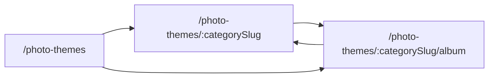

# Photo Themes — Routes, UI, and Functionality

This document describes the **Photo Themes** studio flow: what each URL does, what the user sees, how data is saved, and which files implement it.

**Example URLs (local dev):**

| URL | Page |
|-----|------|
| `http://localhost:3000/photo-themes` | Theme hub — pick a category |
| `http://localhost:3000/photo-themes/birthday` | Cover editor for Birthday |
| `http://localhost:3000/photo-themes/birthday/album` | Multi-page album builder |

All three routes live **inside the main app `Layout`** (sidebar + header), not as standalone full-screen pages.

---

## 1. High-level user journey



1. **Hub** — User sees theme categories (Birthday, Wedding, …) from the API. Each card can list in-progress photobooks and offer **Start Album** or **Continue**.
2. **Category / cover** — User designs **front cover** and **back cover** (last page). Saves to backend, then auto-navigates to the album builder.
3. **Album builder** — User fills **inner pages** with photos, layouts, captions; previews flip book; saves and exports PDF/ZIP/Base64.

**Resume logic (from hub):**

- `currentStep` = `COVER` → open category page (`/photo-themes/birthday`)
- `currentStep` = `ALBUM` or `PREVIEW` → open album builder (`/photo-themes/birthday/album`)

---

## 2. Routing and navigation

**File:** `src/App.tsx`

```text
<Route path="photo-themes" element={<PhotoThemesPage />} />
<Route path="photo-themes/:categorySlug" element={<PhotoThemeCategoryPage />} />
<Route path="photo-themes/:categorySlug/album" element={<PhotoThemeAlbumBuilderPage />} />
```

**Sidebar:** `nav.studio.photoThemes` → `/photo-themes` (`navConfig.tsx`, `portalSettings.ts`, `README.md`).

**Related entry points:**

- **Photo Book** (`/photo-book`) — link “My Photo Books” on hub; can navigate into themes with `templateId` / `photobookId` in `location.state`.
- **Photo Studio Album** — can deep-link to `/photo-themes/:categorySlug` with template context.

**Route params:**

- `:categorySlug` — URL slug, e.g. `birthday`, `wedding`, `anniversary`, `baby-kids`, or custom codes from API (e.g. `shu` from template code).
- Not the numeric DB `templateId`; that travels in **React Router `state`** and **localStorage**.

---

## 3. Page 1 — `/photo-themes` (Theme hub)

**Component:** `src/pages/photo-themes/PhotoThemesPage.tsx`  
**i18n:** `photoThemesPage.*` in `src/locales/en.json` / `hi.json`

### Purpose

Central catalog of **photobook template categories**. User chooses an occasion (Birthday, Wedding, …) and either starts a new book or continues an existing one.

### What happens on load

1. **GET** `/api/photobook-templates?userId=&onlyActive=true` with header `X-API-KEY` (token from `getStoredToken()`).
2. Each active template is mapped to a **theme card**:
   - Known codes (`BIRTHDAY_THEMES`, `ANNIVERSARY_THEMES`, `WEDDING_THEMES`, `BABY_KIDS_THEMES`) → fixed slug, icon, gradient (`templateMetaByCode`).
   - Unknown/custom codes → slug from lowercase code, smart icon/color from name.
3. If API fails → **fallback** four static themes (same slugs as above).
4. For each theme slug → **GET** `/api/photobooks/by-category/{slug}` → list of in-progress albums shown on the card.
5. **localStorage** `lastPhotobookThemePreview` — optional “last design” metadata (not always shown in current UI).

### UI design

| Region | Design |
|--------|--------|
| **Header** | Rounded-3xl card, slate/white gradient, cyan–indigo–violet top accent bar, dark icon tile (`FaPalette`), title “Photo Themes”, subtitle, link **My Photo Books** → `/photo-book`. |
| **Loading** | Same header + `ThemeCardSkeleton` (4 placeholders). |
| **Error banner** | Yellow soft alert if templates failed (still shows fallback cards). |
| **Theme grid** | Responsive 1–4 columns; each **ThemeCard**: white glass card, subtle gradient wash, large gradient icon square, title + subtitle, optional **YOUR ALBUMS** list. |
| **Album rows** | Cyan–indigo gradient pills per saved photobook: title, step badge (`Cover` / `Album pages` / `Preview` / `Completed`), covers/pages chips, **Continue** chevron. |
| **Primary CTA** | Dark slate button **Start Album** / **Create New Album** (gradient hover to cyan–indigo). |
| **Footer info** | Slate “About Photo Themes” explainer block. |

### User actions

| Action | Behavior |
|--------|----------|
| **Start Album** / **Create New Album** | Clears `localStorage` key `photobook_{slug}`; navigates to `/photo-themes/{slug}` with `state: { templateId }`. |
| **Continue** (on album row) | If step is `ALBUM`/`PREVIEW` → `/photo-themes/{slug}/album` with `photobookId`; else → category page with `photobookId`. |
| **My Photo Books** | Navigates to `/photo-book`. |

### Theme card visual mapping (birthday example)

- **Slug:** `birthday` (from `BIRTHDAY_THEMES`)
- **Icon:** `FaStar`
- **Gradient:** pink / rose (`from-pink-500 …`, background `from-pink-50 to-rose-50`)

---

## 4. Page 2 — `/photo-themes/birthday` (Cover & last-page editor)

**Detailed doc (this page only):** [PHOTO-THEMES-CATEGORY.md](./PHOTO-THEMES-CATEGORY.md) — imports, `PageEditorCard`, `EditablePageState`, modals, API, save/load, birthday UI.

**Component:** `src/pages/photo-themes/PhotoThemeCategoryPage.tsx` (~3.1k lines)  
**i18n:** `photoThemeCategoryPage.*`

### Purpose

Design the **front cover** and **back cover** (closing page) for one photobook in a category. Manage **multiple albums** per category. Persist covers to the API, then send the user to the **album builder**.

### URL & state

- **Param:** `categorySlug` = `birthday`
- **Router state (optional):** `templateId`, `photobookId`, `albumImageIds`, `albumName` (from Photo Studio / Photo Book)
- **localStorage:** `photobook_{categorySlug}` → `{ templateId, photobookId }`
- **sessionStorage:** `studioAlbum_{categorySlug}` → filtered image IDs when coming from a studio album

### What happens on load

1. Resolve **theme meta** (title, subtitle, icon, colors) from built-in list + i18n (`themeMetaBirthdayTitle`, …).
2. **GET** `/api/photobooks/by-category/birthday` → **My Albums** grid.
3. If `photobookId` in state/storage → load covers:
   - **GET** `/api/photobooks/{id}/covers` (preferred), or
   - **GET** `/api/covers?userId=&templateId=`
4. Map API cover sides → `EditablePageState` (headline, subheadline, description, image IDs, typography, overlays).
5. **localStorage** `filevault_cover_leaf_v1_{photobookId}` — text-leaf glass/gradient extras backup.

### UI layout (top to bottom)

| Section | UI / behavior |
|---------|----------------|
| **Hero header** | Full-width **indigo → purple → pink** gradient banner, large white icon, theme title + subtitle (e.g. “Birthday Themes”). |
| **My Albums** | White card: header with count + **New Album**; grid of album cards (status chip, page count, progress bar %, last edited date). Buttons: **Continue** / **Edit Covers**, **Open** (album builder, disabled until `hasCovers`), **Delete**. |
| **Status chip** | “Editing Album #N” or “Creating new album” when `activeTemplateId` set. |
| **Front cover editor** | `PageEditorCard` `kind="cover"` — see below. |
| **Back cover editor** | `PageEditorCard` `kind="last"`. |
| **Save success** | Green banner: covers saved, redirecting… |
| **Save error** | Yellow warning (may still redirect after delay). |
| **Footer CTA** | **Save & Create Album** or **Save & Continue to Album** (indigo, spinner while saving). |

### `PageEditorCard` — cover UI (both front & back)

Large **rounded-3xl** card with colored top accent (cyan–violet for front, amber–rose for back).

**Left / center — Live preview**

- Tabs: **Text side** | **Photo side** (mirrors flip-book: text on glass panel first, full-bleed photo second).
- Text side: frosted glass panel over gradient or background image; headline, subheadline, description; draggable **free text overlays**; draggable **logo/decal**.
- Photo side: full-bleed cover image with zoom, overlay gradient, vignette, blur options.
- Click-to-zoom on preview.

**Right — Collapsible panels**

1. **Text & story** — Headline, subheadline, description; emoji quick-insert rows; placeholders differ for front vs back.
2. **Text page — glass & background** — Mode: gradient vs image; custom CSS gradient; glass blur, fill opacity, tint; pick background from FileVault.
3. **Text & layout** — Font size, weight, align, vertical position, font family presets, headline/subheadline colors, description typography block.
4. **Page effects** — Image zoom, letter spacing, line height, text shadow, divider, overlay opacity/direction/color, blur, vignette, dark mode, subtle animation.
5. **Background & logo** — Logo from album or SVG decals; position presets + drag; size slider.
6. **Page image** — `FileVaultImagePicker` modal: choose photo for photo side.

**Image auth:** Preview URLs use `/api/images/{id}/preview?token=…` via `appendPreviewToken`.

### Save flow (`handleSaveCovers`)

1. **POST** `/api/photobooks` if no `photobookId` yet (`templateId`, `categorySlug`, `title` from headline).
2. Resolve image IDs (reuse FileVault IDs; upload data URLs if needed via `imageService`).
3. **POST** `/api/photobooks/{id}/covers` with `frontCover` + `backCover` (fallback **POST** `/api/covers` with `templateId`).
4. Save text-leaf extras to localStorage.
5. Update `localStorage` `photobook_birthday`.
6. After ~2s → **navigate** to `/photo-themes/birthday/album` with `coverPage`, `lastPage`, `dbTemplateId`, `photobookId`.

### Other actions

| Action | API / navigation |
|--------|------------------|
| **New Album** | Reset local state; blank covers; clear `photobook_{slug}` key. |
| **Continue** on album card | Load that photobook’s covers into editors. |
| **Open** | Go to album builder (requires covers saved). |
| **Delete album** | **DELETE** `/api/photobooks/{id}`; refresh list. |

### Birthday-specific defaults

When no saved data, theme defaults can include cake decal SVG, “Happy Birthday” copy (`buildThemeDefaultCover` lives on album page but category starts **blank** for brand-new albums).

---

## 5. Page 3 — `/photo-themes/birthday/album` (Album builder)

**Detailed doc (this page only):** [PHOTO-THEMES-ALBUM-BUILDER.md](./PHOTO-THEMES-ALBUM-BUILDER.md) — imports, internal components, full state list, UI regions, API, birthday flow, test checklist.

**Component:** `src/pages/photo-themes/PhotoThemeAlbumBuilderPage.tsx` (~4.8k lines)  
**i18n:** `photoThemeAlbumBuilderPage.*`  
**See also:** `docs/PHOTOTHEME_ALBUM_BUILDER_SPEC.md` (upgrade plan vs current state)

### Purpose

Build the **full photobook**: cover spread + inner pages + last page. Pick **layouts** per page, assign **photos** from FileVault or studio album, add **captions**, preview as **flip book**, **save** to API, **export** PDF / ZIP / Base64.

### URL & state

- **Param:** `categorySlug` = `birthday`
- **Router state:** `dbTemplateId`, `photobookId`, `coverPage`, `lastPage`, `albumImageIds`, `albumName`, `openPreview`
- Loads template layout definitions from `src/templates/photobookTemplates.ts` + `getPhotoBookTemplate(categorySlug)`.

### What happens on load

1. Resolve `photobookId` / `dbTemplateId` from state, query, or **GET** `/api/photobooks/by-category/birthday`.
2. **GET** `/api/photobooks/{id}` — template id, metadata.
3. **GET** `/api/photobooks/{id}/pages` — saved pages, slots, crops, captions (fallback legacy `/api/album-pages` only when no photobook id).
4. **GET** `/api/photobooks/{id}/covers` — sync cover/last text and images into page state.
5. Build `albumPages[]`: cover (optionally split into text + image leaves for flip), inner pages, last page.
6. Studio banner if `studioAlbum_*` session: “N images available” from linked Photo Studio album.

### UI layout — three-column studio

| Column | Content |
|--------|---------|
| **Top bar (sticky)** | Back → category page; album title; progress bar (% pages with photos); **Preview** (flip book); **Save**; **Export** (PDF). Undo/redo placeholders (disabled). |
| **Left sidebar** | **Photo library** — search, filter chips, grid of thumbnails from studio album or user images; **Add from library**; tap thumbnail then tap slot to apply. |
| **Center** | **Album canvas** — current page at configurable zoom (S/M/L + slider); page badge (Cover / Page N / Back); layout thumbnails with **dynamic previews** using current slot images; slot grid with drag-to-reposition crop, drag-and-drop **swap slots** (`@dnd-kit`); per-slot captions on inner pages; floral frame styles; “Pick photo(s)” modals. |
| **Right sidebar** | **Layout & settings** — photo count filter (1–4 slots), page layout picker, theme background (wedding/anniversary), captions list, link **Edit in Cover Editor** for cover/back pages. |
| **Bottom strip** | Horizontal **page thumbnails** — add/delete page, jump to page, keyboard ←/→. |

### Page types & layouts

- **Types:** `cover` | `inner` | `last`
- **Layouts** (examples): Single Full Bleed, Two Up, Three Grid, Four Grid, Hero + Two, Cinematic Spread, Collage, wedding-specific names — see `PAGE_LAYOUT_CONFIG` in component.
- **Custom layouts:** “Layout studio” — user-defined slot geometry, saved in session as custom layouts.
- **Page count:** Typically 6–18 inner pages (configurable); cover + last bookends.

### Cover / last in builder

- Cover and last page **images** come from category save + API covers.
- Text on cover can be edited in builder (presets: Birthday, Wedding, Anniversary, Minimal) or via link back to **Cover Editor**.
- Flip book treats cover as **two leaves**: text side, then photo side (`flipBookAlbumPages`).

### Preview modes

| Mode | Tech | UX |
|------|------|-----|
| **Flip book modal** | `react-pageflip` (`HTMLFlipBook`) | Landscape/portrait; play/pause slideshow; keyboard nav; zoom. |
| **Single page view** | Modal | One page large. |
| **Print stylesheet** | `@media print` | Hides chrome; one page per sheet. |

### Save (`handleSaveAlbum`)

1. Ensure `photobookId` (create via **POST** `/api/photobooks` if missing).
2. For each page: collect `imageIds` per slot (upload data URLs if needed), `layout`, `cropPositions` JSON, `slotCaptions` JSON, `frameStyle`, theme fields.
3. **POST** `/api/photobooks/{id}/pages` with `{ pages, pageCount, colorTheme, weddingBackground }`.
4. **PUT** `/api/photobooks/{id}` — `currentStep: 'ALBUM'`, `status: 'IN_PROGRESS'`.

### Export

| Export | Behavior |
|--------|----------|
| **PDF** | `jspdf` — renders pages with crops, gradients, text overlays, captions. |
| **Images ZIP** | `jszip` — per-page JPEGs. |
| **Base64 JSON** | Download JSON bundle of page images as base64. |
| **Flipbook HTML** | Standalone HTML flipbook export (where enabled in UI). |

### Theme-specific UI

- **Wedding:** background theme picker (`selectedWeddingBackground`).
- **Anniversary:** color theme picker (`selectedColorTheme`).
- **Birthday:** default headlines/decals in presets; standard layouts.

---

## 6. Backend API summary

| Method | Endpoint | Used on |
|--------|----------|---------|
| GET | `/api/photobook-templates` | Hub, album (resolve template) |
| GET | `/api/photobooks/by-category/{slug}` | Hub cards, category album list, album recovery |
| POST | `/api/photobooks` | Create book (category save, album save) |
| GET | `/api/photobooks/{id}` | Album metadata |
| PUT | `/api/photobooks/{id}` | Update step/status/pageCount |
| DELETE | `/api/photobooks/{id}` | Delete album (category page) |
| GET/POST | `/api/photobooks/{id}/covers` | Load/save front & back cover |
| GET/POST | `/api/photobooks/{id}/pages` | Load/save inner pages |
| GET | `/api/covers` | Legacy cover list by user/template |
| POST | `/api/covers` | Legacy cover save fallback |
| GET | `/api/images/{id}/preview` | All previews (with token query) |

**Auth:** `X-API-KEY` header (and sometimes `Authorization`) from stored login token.

---

## 7. Photobook progress model

Fields used across hub and category **My Albums**:

| Field | Meaning |
|-------|---------|
| `id` | Photobook ID |
| `categorySlug` | e.g. `birthday` |
| `templateId` | DB template FK |
| `title` | Display name |
| `status` | `DRAFT` / `IN_PROGRESS` / `COMPLETED` |
| `currentStep` | `COVER` → category page; `ALBUM` / `PREVIEW` → album builder |
| `hasCovers` | Front/back saved |
| `savedPagesCount` / `pageCount` | Progress % in UI |

---

## 8. localStorage / sessionStorage keys

| Key | Purpose |
|-----|---------|
| `photobook_{slug}` | `{ templateId, photobookId }` for refresh survival |
| `lastPhotobookThemePreview` | Last cover preview metadata (hub) |
| `filevault_cover_leaf_v1_{photobookId}` | Text-leaf glass/gradient extras |
| `studioAlbum_{slug}` | Studio album image ID filter (session) |

---

## 9. Shared components & dependencies

| Piece | Location |
|-------|----------|
| FileVault image picker | `src/components/PhotoBook/FileVaultImagePicker.tsx` |
| Modern album library | `src/components/PhotoBook/ModernAlbumImageLibrary.tsx` |
| Photobook templates (layouts) | `src/templates/photobookTemplates.ts` |
| Image service (upload) | `src/api/services/imageService.ts` |
| Axios client | `src/api/client/axiosInstance.ts` |
| Flip book | `react-pageflip` |
| PDF | `jspdf` |
| ZIP | `jszip` |
| Drag and drop | `@dnd-kit/core` |

---

## 10. Internationalization

All user-visible strings should go through i18n:

- `photoThemesPage.*` — hub
- `photoThemeCategoryPage.*` — cover editor (~200 keys)
- `photoThemeAlbumBuilderPage.*` — album builder (~150+ keys)

Hindi: `src/locales/hi.json` (same key structure).

---

## 11. Design system (cross-page)

| Token | Usage |
|-------|--------|
| **Primary indigo** | `#6366f1` / `indigo-600` — buttons, rings, progress |
| **Accent cyan–violet** | Hub header bar, album continue pills |
| **Slate neutrals** | Cards, borders `slate-200`, text `slate-500–900` |
| **Category gradients** | Birthday pink/rose, wedding purple, anniversary red/pink |
| **Cards** | `rounded-2xl` / `rounded-3xl`, soft shadow, `border-slate-200/80` |
| **Glass panels** | Cover text side — blur + semi-transparent fill |
| **Typography** | System + preset font stacks (serif, script, display, etc.) |

Responsive: hub grid 1→4 cols; album builder stacks sidebars on mobile (`md:` breakpoints); category editors single column on small screens.

---

## 12. File map (implementation)

```text
src/pages/photo-themes/
  PhotoThemesPage.tsx           → /photo-themes
  PhotoThemeCategoryPage.tsx    → /photo-themes/:categorySlug
  PhotoThemeAlbumBuilderPage.tsx → /photo-themes/:categorySlug/album

src/App.tsx                     → route registration
src/components/layout/navConfig.tsx → sidebar icon
src/locales/en.json | hi.json   → copy
docs/PHOTOTHEME_ALBUM_BUILDER_SPEC.md → album builder upgrade notes
```

---

## 13. Known behaviors & edge cases

1. **New album from hub** clears `photobook_{slug}` so category page starts fresh (blank covers).
2. **Resume** respects `currentStep` — do not send `ALBUM` users to cover-only flow unless they choose **Edit Covers**.
3. **Save cover failure** — category page may still redirect to album after 3s with error banner (best-effort UX).
4. **Template ID** must flow via `state` or localStorage; slug alone is not enough for API writes.
5. **Preview images** require token on URL when API is on another origin than the SPA.
6. **Album save** prefers photobook-scoped endpoints; avoids wrong book via legacy `/api/album-pages` when `photobookId` exists.
7. **Custom templates** from API get generated slugs; meta icon/color inferred from name/code.

---

## 14. Quick test checklist (birthday path)

1. Open `/photo-themes` — four+ cards load; birthday card shows pink star icon.
2. Click **Start Album** → `/photo-themes/birthday` — hero + empty cover editors.
3. Set headline, pick cover photo, **Save & Create Album** → redirect to `/photo-themes/birthday/album`.
4. Add photos to inner pages, change layouts, **Save**.
5. **Preview** flip book — cover shows text leaf then photo leaf.
6. **Export** PDF — downloads without auth errors on images.
7. Back to hub — birthday card lists album with **Continue** and step label.

---

*Last updated: May 2026 — matches `PhotoThemesPage`, `PhotoThemeCategoryPage`, and `PhotoThemeAlbumBuilderPage` in filevault.*
