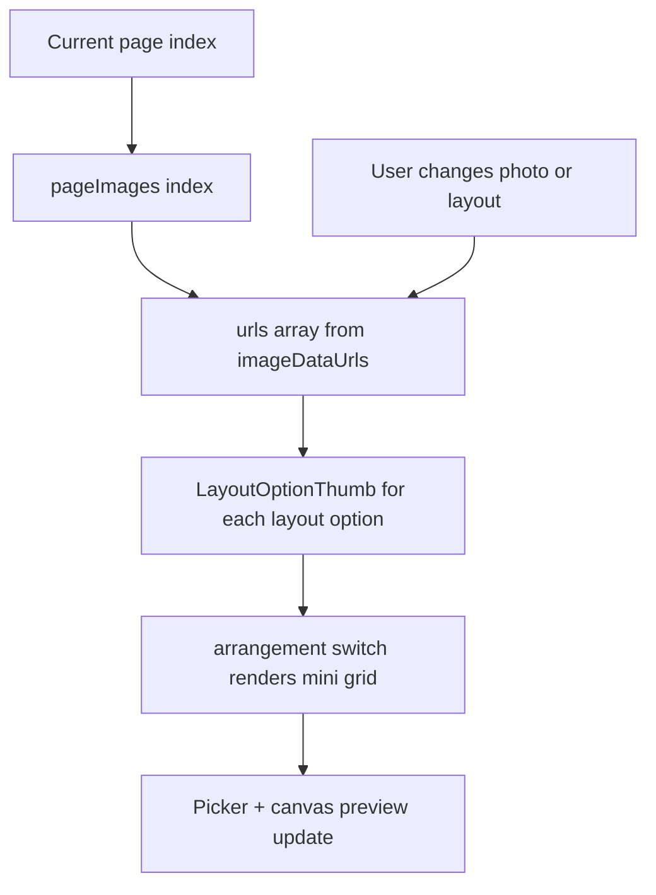

# Photo Theme — Layouts, Photo Count & Dynamic UI

Reference for the **Album Builder** right panel (`Layouts` tab) on `/photo-themes/:categorySlug/album`.

**Source of truth (code):** `src/pages/photo-themes/PhotoThemeAlbumBuilderPage.tsx`  
**i18n keys:** `photoThemeAlbumBuilderPage.*` in `src/locales/en.json`

---

## 1. Panel structure (right sidebar)

| Section | Label (UI) | Purpose |
|---------|------------|---------|
| Tab bar | **Layouts** · **Cover text** · **Theme** | Switch between layout controls, cover typography, wedding/anniversary themes |
| Filter | **Photo count** | Narrow layout picker to layouts with N slots |
| Picker | **Page layout** | Choose arrangement for the **current page**; thumbnails use **current page photos** |
| Action | **Create Layout** | Opens **Layout Studio** modal — custom slot geometry |
| Slots | **Photo slots** | 88×88 slot cards; drag-to-swap; add/remove photos |
| Text | **Captions** | One caption input per slot (inner pages only) |

---

## 2. Photo count filter

Quick filter chips above the layout grid.

| Chip | Shows layouts with |
|------|-------------------|
| **1** | Exactly 1 photo slot |
| **2** | Exactly 2 slots |
| **3** | Exactly 3 slots |
| **4** | Exactly 4 slots |
| **5** | Exactly 5 slots |
| **6** | Exactly 6 slots |
| **All** | Every built-in + custom layout |

**State:** `layoutQuickFilter` (`1` \| `2` \| `3` \| `4` \| `5` \| `6` \| `'all'`)

**Filter logic:**

```text
filteredLayoutConfig = layoutQuickFilter === 'all'
  ? allLayoutConfig
  : allLayoutConfig.filter(c => c.slotCount === layoutQuickFilter)
```

**UI:** Small pill buttons; active chip = indigo tint + border.

---

## 3. Page layout picker

### 3.1 Built-in layouts (complete catalog)

Each row: **ID** (saved to API) · **Short label** (picker) · **Slots** · **Arrangement** (render engine)

#### 1 photo

| ID | Short label | Slots | Arrangement | Visual |
|----|-------------|-------|-------------|--------|
| `Single Full Bleed` | Full bleed | 1 | `single` | One image edge-to-edge (100×100%) |
| `Cinematic Love` | Cinematic | 1 | `cinematic` | Wide strip (~2.35:1) centered on dark letterbox |
| `Single Photo` *(legacy)* | Single | 1 | `single` | Same as Full bleed |
| `Cinematic Spread` *(legacy)* | Cinema | 1 | `cinematic` | Same as Cinematic Love |

#### 2 photos

| ID | Short label | Slots | Arrangement | Visual |
|----|-------------|-------|-------------|--------|
| `Love Side by Side` | Side by side | 2 | `two-up` | 50% \| 50% horizontal split |
| `Bride & Groom` | Stacked | 2 | `two-vertical` | 50% top + 50% bottom |
| `Two Up` *(legacy)* | Two up | 2 | `two-up` | Same as Side by side |

#### 3 photos

| ID | Short label | Slots | Arrangement | Visual |
|----|-------------|-------|-------------|--------|
| `Hero + Memories` | Hero + two | 3 | `hero-two` | Large hero top (60%) + two bottom (40%) |
| `Three Grid` | Three grid | 3 | `three-grid` | Tall left column + two stacked right |
| `Romantic Collage` | Romantic collage | 3 | `collage` | Three overlapping frames (z-index center) |
| `Hero + Two` *(legacy)* | Hero | 3 | `hero-two` | Same as Hero + Memories |
| `Collage` *(legacy)* | Collage | 3 | `collage` | Same as Romantic Collage |

#### 4 photos

| ID | Short label | Slots | Arrangement | Visual |
|----|-------------|-------|-------------|--------|
| `Wedding Grid` | Classic grid | 4 | `four-grid` | 2×2 equal grid |
| `Memory Collage` | Overlap collage | 4 | `collage` | 2×2 base with overlap styling |
| `Luxury Cover` | Luxury cover | 4 | `luxury-cover` | 3 small left stack + 1 tall right hero |
| `Cinematic Inner` | Hero + three | 4 | `luxury-inner` | Wide hero top + three equal bottom |
| `Four Grid` *(legacy)* | Grid 4 | 4 | `four-grid` | Same as Classic grid |

#### 5 photos

| ID | Short label | Slots | Arrangement | Visual |
|----|-------------|-------|-------------|--------|
| `Hero Wedding Story` | Hero + four | 5 | `hero-four` | Hero top + four equal thumbnails bottom |

#### 6 photos

| ID | Short label | Slots | Arrangement | Visual |
|----|-------------|-------|-------------|--------|
| `Memories Spread` | Six grid | 6 | `six-grid` | 3×2 grid |

### 3.2 Picker UI behavior

| Property | Value |
|----------|-------|
| Grid | 3 columns, scrollable (`max-h-40`) |
| Thumbnail aspect | 4:3 |
| Thumbnail content | **Dynamic** — `LayoutOptionThumb` fills slots with current page `urls[]`; empty slots show placeholder icon |
| Selected state | Amber ring + `bg-amber-50` |
| Click | Sets `pageLayouts[pageIndex]` and `pageImages[pageIndex].layout` |
| Tooltip / label | i18n short label via `LAYOUT_SHORT_TKEY` |

### 3.3 Percent geometry (`LAYOUT_GEOMETRY`)

Optional percent-based slot rects `{ x, y, width, height }` used for PDF/export and custom rendering. Example entries:

```json
"Hero + Memories": [
  { "x": 0, "y": 0, "width": 100, "height": 60 },
  { "x": 0, "y": 60, "width": 50, "height": 40 },
  { "x": 50, "y": 60, "width": 50, "height": 40 }
]
```

Full map lives in `LAYOUT_GEOMETRY` in `PhotoThemeAlbumBuilderPage.tsx`.

---

## 4. Create Layout (Layout Studio)

**Trigger:** **Create Layout** button (+ icon) next to **Page layout** heading.

### 4.1 Modal layout

| Region | Contents |
|--------|----------|
| **Center canvas** | 4:3 page preview; slots positioned with `%` left/top/width/height |
| **Right controls** | Template name, background gradient, optional bg image URL, corner radius, shadow toggle |
| **Per-slot editor** | When a box is selected: sliders for **X**, **Y**, **WIDTH**, **HEIGHT** (0–95% / 5–100%) |
| **Footer** | Box count summary · **Cancel** · **Save Layout & Apply** |

### 4.2 Default starter geometry (4 boxes)

```text
Box 1: x=4,  y=5,  w=58, h=90  (large left)
Box 2: x=66, y=5,  w=30, h=27  (top-right)
Box 3: x=66, y=36, w=30, h=27  (mid-right)
Box 4: x=66, y=67, w=30, h=28  (bottom-right)
```

### 4.3 Save flow

1. User names layout (default: `Premium Layout N`).
2. **Save Layout & Apply** creates `{ id, shortLabel, slotCount, geometry }`.
3. Appended to `customLayouts` and merged into `allLayoutConfig`.
4. Applied immediately to current page.
5. Custom layouts appear in picker when **All** or matching **Photo count** is selected.

**Note:** Custom layouts use `arrangement: 'single'` for thumb fallback; rendering uses stored `geometry` rects.

### 4.4 Background presets (studio)

| Name | CSS gradient |
|------|----------------|
| Clean White | `linear-gradient(135deg,#ffffff,#f8fafc)` |
| Royal Dark | `linear-gradient(135deg,#0f172a,#312e81)` |
| Wedding Soft | `linear-gradient(135deg,#fff7ed,#fce7f3)` |
| Romantic Pink | `linear-gradient(135deg,#fdf2f8,#ede9fe)` |
| Sky Premium | `linear-gradient(135deg,#ecfeff,#e0f2fe)` |

---

## 5. Photo slots

Section below the layout picker on the **Layouts** tab.

### 5.1 Slot count

```text
slotCount = getSlotCountForLayoutId(currentLayoutId)
```

Renders `slotCount` × `AlbumSlotCard` components.

### 5.2 Slot card (`AlbumSlotCard`)

| State | Appearance | Interaction |
|-------|--------------|-------------|
| **Empty** | Dashed border, slate background, “+ Add photo” | Click → open FileVault picker **or** apply pending library selection |
| **Filled** | Amber border, thumbnail, slot number badge | Click → replace photo; drag → swap with another slot; hover → remove (×) |

**Size:** 88×88 px, rounded-xl.

### 5.3 Drag and drop

- Library: **@dnd-kit** — drag filled slot onto another to swap URLs + image IDs.
- Canvas: separate crop drag (`DraggableCropImage`) for position/zoom inside slot.

### 5.4 Add photo button

Dark **Add photo** opens multi-select picker when layout has multiple empty slots; single-slot opens one picker.

### 5.5 Data model (per page)

```typescript
{
  layout: string;              // layout ID
  imageDataUrl?: string;       // slot 0 (legacy single)
  imageDataUrls?: string[];    // all slots
  imageIds?: number[];         // FileVault IDs per slot
  slotCaptions?: string[];     // inner pages
  cropPositions?: object;      // per-slot crop JSON
}
```

---

## 6. Dynamic UI — how thumbnails stay live



**Rules:**

1. Picker always reads **current page** images, not global library.
2. Missing slot N → placeholder silhouette (layout structure still visible).
3. Slot 0 image may backfill empty higher slots in thumb preview (`urls[i] ?? urls[0]`).
4. Changing layout does **not** delete photos; extra slots stay in `imageDataUrls` until trimmed on save.

---

## 7. Arrangement render reference

Used by `LayoutOptionThumb`, canvas preview, PDF export.

| Arrangement | Slot layout | CSS / structure |
|-------------|---------------|-----------------|
| `single` | 1 | Full bleed |
| `cinematic` | 1 | Dark frame + ~42% height center strip |
| `two-up` | 2 | `flex` row 50/50 |
| `two-vertical` | 2 | `flex` col 50/50 |
| `three-grid` | 3 | Left `row-span-2` + 2 right cells |
| `hero-two` | 3 | Top 1.5fr + bottom 2-col |
| `four-grid` | 4 | 2×2 grid |
| `collage` | 3–4 | Absolute positioned overlapping rects |
| `luxury-cover` | 4 | 38% left column (3 stacked) + 62% right |
| `luxury-inner` | 4 | Top hero 1.4fr + bottom 3-col |
| `hero-four` | 5 | Top hero 1.2fr + bottom 4-col |
| `six-grid` | 6 | 3×2 grid |

---

## 8. Adding more layouts (checklist)

To add a new built-in layout:

1. **`PAGE_LAYOUT_CONFIG`** — add `{ id, shortLabel, slotCount, arrangement }`.
2. **`LAYOUT_GEOMETRY`** — add percent rects (one per slot) for export/PDF.
3. **`LAYOUT_SHORT_TKEY`** — map id → i18n key.
4. **`LayoutOptionThumb` switch** — add/extend `case` if new `arrangement` type.
5. **Canvas + PDF renderers** — mirror arrangement in main preview and PDF block (~lines 2000+).
6. **`src/locales/en.json`** (+ `hi.json`) — add label under `photoThemeAlbumBuilderPage`.
7. **Photo count filter** — no code change if `slotCount` is 1–6; new counts need new chip.

### Suggested future layouts (not yet implemented)

| Name | Slots | Idea |
|------|-------|------|
| Film strip | 3–5 | Horizontal strip with sprocket margins |
| Polaroid stack | 3 | Rotated frames with white borders |
| Magazine spread | 2 | Large image + sidebar text column |
| Timeline | 4–6 | Vertical line + alternating thumbs |
| Circle focus | 1–3 | Circular masks, center hero |
| Diagonal split | 2 | 45° divide |
| Story vertical | 3 | Full-width strips stacked (mobile-story style) |
| Five mosaic | 5 | Asymmetric masonry (non-hero) |

Use **Create Layout** for one-off designs until a pattern is stable enough to promote to `PAGE_LAYOUT_CONFIG`.

---

## 9. Legacy ID compatibility

Saved albums may reference older layout IDs. Keep these aliases in config (same arrangement as modern names):

| Legacy ID | Maps to |
|-----------|---------|
| `Single Photo` | Full bleed |
| `Two Up` | Side by side |
| `Hero + Two` | Hero + two |
| `Four Grid` | Classic grid |
| `Cinematic Spread` | Cinematic |
| `Collage` | Romantic collage |

---

## 10. Related docs

- [PHOTO-THEMES.md](./PHOTO-THEMES.md) — full routes & album flow
- [PHOTOTHEME_ALBUM_BUILDER_SPEC.md](./PHOTOTHEME_ALBUM_BUILDER_SPEC.md) — UX upgrade plan
- [PHOTO-THEMES-ALBUM-BUILDER.md](./PHOTO-THEMES-ALBUM-BUILDER.md) — detailed builder notes
