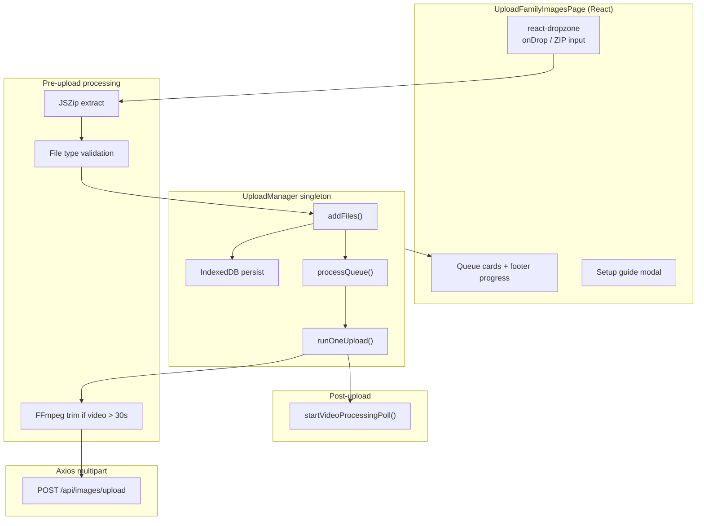

# Upload Family Images — Core Frontend Upload System

Route: **`/upload-family-images`**  
Main file: **`src/pages/images/UploadFamilyImagesPage.tsx`** (~2,370 lines)

This document describes **how the core upload system works in the browser** — queue, persistence, file handling, UI, retries, and video trim. It focuses on **functional client-side behavior** for uploading files to **your own account**.

> **Out of scope:** album attach, family/client upload, and Our Memories hooks are not covered here.

---

## Table of contents

1. [What this page does](#1-what-this-page-does)
2. [Tech stack & libraries](#2-tech-stack--libraries)
3. [High-level architecture](#3-high-level-architecture)
4. [UploadManager singleton](#4-uploadmanager-singleton)
5. [IndexedDB persistence](#5-indexeddb-persistence)
6. [File intake pipeline](#6-file-intake-pipeline)
7. [Video auto-trim (FFmpeg WASM)](#7-video-auto-trim-ffmpeg-wasm)
8. [Upload execution (multipart FormData)](#8-upload-execution-multipart-formdata)
9. [Video post-upload poll](#9-video-post-upload-poll)
10. [React UI & user flows](#10-react-ui--user-flows)
11. [Permissions & prerequisites](#11-permissions--prerequisites)
12. [Offline, retry & concurrency rules](#12-offline-retry--concurrency-rules)
13. [Supporting utilities](#13-supporting-utilities)
14. [Related files map](#14-related-files-map)
15. [Key constants reference](#15-key-constants-reference)
16. [What is NOT used on this page](#16-what-is-not-used-on-this-page)

---

## 1. What this page does

The upload page is FileVault’s **bulk media upload hub** for your own library. Core capabilities:

| Capability | Details |
|------------|---------|
| Drag & drop / file picker | Multiple files via `react-dropzone` |
| ZIP upload | Extract images/videos from `.zip` using **JSZip** |
| My account upload | Upload to logged-in user’s library |
| Video support | Auto-trim videos **> 30 seconds** to first 30s (FFmpeg WASM) |
| Persistent queue | Survives page refresh and navigation via **IndexedDB** |
| Concurrent uploads | Up to **3** files uploading at once |
| Offline handling | Pauses active uploads; resumes when back online |
| Auto-retry | Exponential backoff, max **3** retries per file |
| Video transcoding UI | Polls backend until video status is `READY` |

Route registration (`App.tsx`):

```tsx
<Route path="upload-family-images" element={<UploadFamilyImagesPage />} />
```

---

## 2. Tech stack & libraries

| Library / API | Role on this page |
|---------------|-------------------|
| **`react-dropzone`** | Drag-drop zone, file picker, MIME accept filters |
| **`JSZip`** | Read ZIP in browser, extract image/video entries |
| **`@ffmpeg/ffmpeg` + `@ffmpeg/util`** | Client-side video trim to 30s (WASM from jsDelivr CDN) |
| **IndexedDB** | Persist queue items + file blobs across refresh |
| **Axios** (`api` from `axiosInstance`) | Multipart upload with progress + abort signal |
| **`@tanstack/react-query`** | User profile, storage usage, cloud services |
| **`react-hot-toast`** | Success/error/loading toasts |
| **`react-i18next`** | All UI strings under `uploadFamilyPage.*` |
| **Singleton `UploadManager` class** | Queue processor living **outside React** (survives unmount) |

**Upload transport:** standard **`multipart/form-data`** POST with a `file` field.  
**Not used here:** `src/api/services/chunkedUploadService.ts` (chunked upload exists in codebase but this page does **not** call it).

---

## 3. High-level architecture



**Design principle:** React only **displays** queue state. The **`UploadManager` singleton** owns queue logic, runs uploads even if the component unmounts, and notifies React via a subscribe/listener pattern.

---

## 4. UploadManager singleton

Defined inline in `UploadFamilyImagesPage.tsx` (lines ~220–659). One instance:

```tsx
const uploadManager = new UploadManager();
```

### 4.1 Queue item types

```tsx
export type QueueItemStatus =
  | 'waiting'
  | 'processing'   // video trim in progress
  | 'uploading'
  | 'paused'       // offline or aborted
  | 'completed'
  | 'failed';

export interface QueueItemMeta {
  id: string;
  fileName: string;
  fileSize: number;
  fileType: string;
  fileKey: string;              // duplicate key: name-size-lastModified
  status: QueueItemStatus;
  progress: number;             // 0–100
  retries: number;
  response?: unknown;
  error?: string;
  successMessage?: string;
  imageId?: number | string;
  videoId?: number;
  streamUrl?: string;
  statusPollUrl?: string;
  mediaType?: 'IMAGE' | 'VIDEO';
  videoStatus?: string;
  createdAt: number;
}

export interface QueueItem extends QueueItemMeta {
  file: File;  // in memory; rebuilt from blob when restored from IDB
}
```

### 4.2 Public API

| Method | Behavior |
|--------|----------|
| `getState()` | Returns `{ items: QueueItem[], isOnline: boolean }` |
| `subscribe(listener)` | React calls this to re-render on queue changes |
| `setOnline(online)` | On offline: abort active uploads, mark `uploading` → `paused`. On online: resume queue |
| `loadFromPersisted()` | Load all items from IndexedDB on mount |
| `addFiles(files, options?)` | Dedupe by `fileKey`, persist, start processing. Returns `{ added, skipped, skippedDueToLimit }` |
| `remove(id)` | Abort if active, delete from memory + IDB |
| `retry(id)` | Reset failed/paused item to `waiting`, retries=0 |
| `clearFinished()` | Remove all `completed` and `failed` items from queue + IDB |

### 4.3 Queue processing algorithm

```
processQueue():
  if !online or already processing → return
  if activeUploads.size >= MAX_CONCURRENT (3) → return

  next = getNextToUpload()
  if !next → return

  mark next as 'processing' (video) or 'uploading' (image)
  create AbortController, store in activeUploads
  await runOneUpload(item, signal)
  cleanup, then recursively processQueue()
```

**Video concurrency rule:** Only **one video** may be in `processing` or `uploading` at a time (trim is CPU-heavy). Images can run up to 3 concurrent.

```tsx
private getNextToUpload(): QueueItem | undefined {
  const candidate = this.items.find(
    (i) =>
      (i.status === 'waiting' || i.status === 'paused') &&
      !this.activeUploads.has(i.id)
  );
  if (!candidate) return undefined;
  if (this.isVideo(candidate)) {
    const anotherVideoActive = this.items.some(
      (i) =>
        i.id !== candidate.id &&
        this.isVideo(i) &&
        (i.status === 'processing' || i.status === 'uploading')
    );
    if (anotherVideoActive) return undefined;
  }
  return candidate;
}
```

### 4.4 Duplicate detection

```tsx
function fileToKey(file: File): string {
  return `${file.name}-${file.size}-${file.lastModified ?? Date.now()}`;
}
```

If the same key already exists in the queue, the file is **skipped** (toast: skipped duplicates).

---

## 5. IndexedDB persistence

| Setting | Value |
|---------|-------|
| Database name | `FileVaultUploadQueue` |
| Version | `1` |
| Object store | `queue` (keyPath: `id`) |

Each stored record = `QueueItemMeta` + **`blob`** (the actual file bytes).

```tsx
async function putStored(item: QueueItemStored): Promise<void> {
  const db = await openDB();
  const tx = db.transaction(UPLOAD_STORE_NAME, 'readwrite');
  tx.objectStore(UPLOAD_STORE_NAME).put(item);
  // ...
}
```

**On page load:**

```tsx
useEffect(() => {
  uploadManager.loadFromPersisted();
}, []);
```

Restored items become `File` objects again:

```tsx
file: new File([s.blob], s.fileName, { type: s.fileType })
```

Then `processQueue()` resumes automatically if online.

**Important:** `/upload` (`UploadPage.tsx`) uses the **same** IndexedDB database name. Both routes share one physical queue store.

---

## 6. File intake pipeline

### 6.1 Entry points

1. **Drag & drop / Select Files** — `useDropzone` with `onDrop`
2. **Select ZIP** — hidden `<input type="file" accept=".zip">` → `onZipInputChange`

Dropzone config:

```tsx
const { getRootProps, getInputProps, isDragActive, open: openFilePicker } = useDropzone({
  onDrop,
  accept: getAcceptTypes(),   // built from user profile allowedFileTypes
  multiple: true,
  disabled: !canUpload() || isAddingFiles,
  noClick: true,              // only explicit button opens picker
  noKeyboard: true,
});
```

### 6.2 ZIP handling

Constants:

```tsx
const MAX_ZIP_SIZE_BYTES = 100 * 1024 * 1024 * 1024; // 100 GB (code constant)
const MAX_ZIP_SIZE_GB = 1;                            // shown in user-facing toasts
```

Allowed extensions inside ZIP:

```tsx
const ZIP_IMAGE_EXT = new Set(['jpg', 'jpeg', 'png', 'gif', 'bmp', 'webp', 'heic']);
const ZIP_VIDEO_EXT = new Set(['mp4', 'mov', 'avi', 'mkv', 'webm', 'm4v']);
```

Flow:

1. Filter ZIP files; reject if over size limit
2. Read each ZIP to `ArrayBuffer` via `FileReader` (more reliable after drop than `file.arrayBuffer()`)
3. `JSZip.loadAsync(buffer)` → iterate entries
4. Skip directories, `__MACOSX`, dotfiles, `.DS_Store`
5. Extract matching media → create new `File` objects with correct MIME
6. Merge with non-ZIP files from the same drop
7. Validate types → `uploadManager.addFiles(valid)`

```tsx
async function extractImagesAndVideosFromZipBuffer(
  arrayBuffer: ArrayBuffer,
  _zipFileName: string
): Promise<File[]> {
  const zip = await JSZip.loadAsync(arrayBuffer);
  const results: File[] = [];
  for (const [path, entry] of Object.entries(zip.files)) {
    if (entry.dir) continue;
    if (path.includes('__MACOSX') || /(^|\/)\./.test(path) || path.endsWith('.DS_Store')) continue;
    const base = path.replace(/^.*\//, '');
    const ext = base.split('.').pop()?.toLowerCase() ?? '';
    if (!ZIP_IMAGE_EXT.has(ext) && !ZIP_VIDEO_EXT.has(ext)) continue;
    const blob = await entry.async('blob');
    results.push(new File([blob], base, { type: getMimeForExt(ext) }));
  }
  return results;
}
```

### 6.3 File type validation

`isFileTypeAllowed(file)`:

- **Videos always allowed** when `userProfile.canUploadImages` is true (mp4, mov, avi, mkv, webm, m4v — by extension or `video/*` MIME)
- **Images/docs** checked against `userProfile.allowedFileTypes` (comma-separated extensions from profile)
- ZIP itself is accepted in dropzone; only extracted media is validated

`getAcceptTypes()` builds the dropzone `accept` map:

- Always: `video/*` + `.zip`
- Images if allowed in profile: `image/*`
- Optional: `pdf`, `doc`, `docx`

### 6.4 Adding to queue

When files pass validation:

```tsx
const { added, skipped, skippedDueToLimit } = await uploadManager.addFiles(valid);
setQueueState(uploadManager.getState());
if (added) toast.success(i18n.t('uploadFamilyPage.filesAddedQueue', { n: added }));
if (skipped) toast(i18n.t('uploadFamilyPage.skippedDuplicates', { n: skipped }));
if (skippedDueToLimit) toast.error(i18n.t('uploadFamilyPage.queueLimit', { max: MAX_UPLOAD_QUEUE, n: skippedDueToLimit }));
```

---

## 7. Video auto-trim (FFmpeg WASM)

File: **`src/utils/videoTrim.ts`**

| Constant | Value |
|----------|-------|
| `VIDEO_TRIM_THRESHOLD_SECONDS` | 30 |
| Trim method | First 30 seconds, `-c copy` (no re-encode) |

Flow inside `runOneUpload`:

```tsx
if (isVideoFile(currentItem.file)) {
  const duration = await getVideoDuration(currentItem.file);  // HTMLVideoElement metadata
  if (duration > VIDEO_TRIM_THRESHOLD_SECONDS) {
    update({ status: 'processing' });
    const trimmedFile = await trimVideoTo30Seconds(currentItem.file);
    update({
      file: trimmedFile,
      fileSize: trimmedFile.size,
      fileKey: fileToKey(trimmedFile),
      fileName: trimmedFile.name,
      status: 'uploading',
    });
  }
}
```

FFmpeg loads from CDN:

```tsx
const baseURL = 'https://cdn.jsdelivr.net/npm/@ffmpeg/core@0.12.6/dist/umd';
await ffmpeg.load({
  coreURL: await toBlobURL(`${baseURL}/ffmpeg-core.js`, 'text/javascript'),
  wasmURL: await toBlobURL(`${baseURL}/ffmpeg-core.wasm`, 'application/wasm'),
});
```

**No user confirmation** — trimming is automatic and silent.

---

## 8. Upload execution (multipart FormData)

All uploads go to **your own account** via a single endpoint:

```tsx
const formData = new FormData();
formData.append('file', currentItem.file);

const token = getStoredToken();
const headers: Record<string, string> = { 'Content-Type': 'multipart/form-data' };
if (token) headers.Authorization = `Bearer ${token}`;

await api.post('/api/images/upload', formData, {
  headers,
  timeout: UPLOAD_TIMEOUT_MS,  // 0 = no timeout
  signal,                       // AbortController for cancel/offline
  onUploadProgress: (ev) => {
    if (ev.total && ev.total > 0) {
      const pct = Math.round((ev.loaded / ev.total) * 100);
      update({ progress: pct });
    }
  },
});
```

### Response handling

```tsx
const mediaFields = fieldsFromUploadResponse(response.data);
// → imageId, videoId, streamUrl, statusPollUrl, mediaType, videoStatus

update({
  status: 'completed',
  progress: 100,
  response: data,
  successMessage: i18n.t('uploadFamilyPage.successDefault', { fileName: currentItem.fileName }),
  ...mediaFields,
});

if (mediaFields.mediaType === 'VIDEO') {
  startVideoProcessingPoll(mediaFields, (status) => {
    // updates videoStatus on queue item → UI shows "Transcoding"
  });
}
```

### Error & retry inside `runOneUpload`

```tsx
catch (err) {
  if (err.name === 'AbortError') {
    update({ status: 'paused' });
    return;
  }
  const newRetries = currentItem.retries + 1;
  if (newRetries >= MAX_RETRIES) {
    update({ status: 'failed', error: errorMessage, retries: newRetries });
    return;
  }
  update({ status: 'waiting', error: errorMessage, retries: newRetries, progress: 0 });
  const delay = Math.min(1000 * Math.pow(2, newRetries), 30000);
  await new Promise((r) => setTimeout(r, delay));
  if (this.isOnline && !signal.aborted) this.processQueue();
}
```

Axios auto-attaches `Authorization: Bearer ${localStorage.token}` from `axiosInstance` if not already set.

---

## 9. Video post-upload poll

File: **`src/utils/mediaUploadQueue.ts`**

After a video upload completes, the UI polls until transcoding is done:

```tsx
export function startVideoProcessingPoll(fields, onStatus) {
  if (fields.mediaType !== 'VIDEO' || fields.videoId == null) return;
  if (fields.videoStatus === 'READY') return;

  void pollVideoUntilReady(fields.videoId, {
    statusPollUrl: fields.statusPollUrl,
    onStatus: (s) => onStatus(s),
  });
}
```

`pollVideoUntilReady` (in `videoService.ts`) polls until status is `READY` or `FAILED`, triggers reprocess if `UPLOADED`.

Queue card shows **"Transcoding"** badge when video completed but `videoStatus !== 'READY'`.

---

## 10. React UI & user flows

### 10.1 Page layout

| Section | Content |
|---------|---------|
| Upload zone | Dropzone, Select Files, Select ZIP, feature hints |
| Queue | Card grid of queue items |
| Footer bar | Fixed bottom — overall progress, Clear finished |

CSS: **`src/styles/app-portal-pages.css`** — `.upload-family-page`, `.uf-card`, dark mode variables.

### 10.2 Loading & error gates

| Condition | UI |
|-----------|-----|
| Profile loading | `FamilyMemberSkeleton` |
| Profile error | Retry card |
| `!canUpload()` | "Upload not available" (no permission or no cloud) |
| Cloud not connected | Setup banner + modal (auto-shown once) |

### 10.3 Cloud storage prerequisite

Upload blocked until at least one service is:

```tsx
s.isConfigured && s.isEnabled && s.connectionStatus === 'CONNECTED'
```

From `GET /api/services/user`. Setup guide links to `/services`.

### 10.4 Queue card states

| Status | UI |
|--------|-----|
| `waiting` | Gray label, 0% progress |
| `processing` | Blue "Processing", ~33% progress bar |
| `uploading` | Blue striped animated progress |
| `paused` | Amber offline message |
| `completed` | Green bar, success message, transcoding badge for video |
| `failed` | Red bar, error text, Retry button |

Thumbnails: `URL.createObjectURL(file)` cached in `thumbnailUrlsRef`; revoked on remove/clear.

### 10.5 Toasts

| Event | Toast |
|-------|-------|
| Files added | `filesAddedQueue` |
| Duplicate skipped | `skippedDuplicates` |
| Queue full (1000) | `queueLimit` |
| ZIP extracting | loading toast |
| ZIP no media | warning |
| ZIP too large | error per file |

### 10.6 Setup guide modal

Shown when cloud storage is not connected. Steps:

1. Connect Google Drive / Backblaze (links to `/services`)
2. Upload files once connected

---

## 11. Permissions & prerequisites

`canUpload()` requires **all** of:

```tsx
userProfile?.canUploadImages
userProfile?.allowedFileTypes   // must exist (even if videos bypass extension check)
cloudStorageReady               // at least one connected cloud service
```

Profile loaded via:

```tsx
useQuery({ queryKey: ['userProfile'], queryFn: () => api.get('/api/auth/profile') })
```

Storage display:

```tsx
useQuery({ queryKey: ['storageUsage'], queryFn: () => imageService.getStorageUsage() })
```

---

## 12. Offline, retry & concurrency rules

| Rule | Value / behavior |
|------|------------------|
| Max concurrent uploads | **3** (`MAX_CONCURRENT`) |
| Max queue size | **1000** items (`MAX_UPLOAD_QUEUE`) |
| Max retries | **3** (`MAX_RETRIES`) |
| Retry delay | Exponential: `min(1000 * 2^retries, 30000)` ms |
| Upload timeout | **0** (no timeout — large files) |
| Offline | Abort all active; status → `paused`; resume on `online` event |
| Cancel/remove | `AbortController.abort()` + delete from IDB |

Online/offline listeners:

```tsx
useEffect(() => {
  const onOnline = () => uploadManager.setOnline(true);
  const onOffline = () => uploadManager.setOnline(false);
  window.addEventListener('online', onOnline);
  window.addEventListener('offline', onOffline);
  return () => {
    window.removeEventListener('online', onOnline);
    window.removeEventListener('offline', onOffline);
  };
}, []);
```

---

## 13. Supporting utilities

### 13.1 `fieldsFromUploadResponse` — `src/utils/mediaUploadQueue.ts`

```tsx
export function fieldsFromUploadResponse(data: unknown): MediaUploadQueueFields {
  const parsed = parseMediaUploadResponse(data);
  return {
    imageId: parsed.imageId,
    videoId: parsed.videoId,
    streamUrl: parsed.streamUrl,
    statusPollUrl: parsed.statusPollUrl,
    mediaType: parsed.mediaType,
    videoStatus: parsed.status,
  };
}
```

### 13.2 `parseMediaUploadResponse` — `src/utils/videoPlayback.ts`

Normalizes upload response JSON into image vs video ids, stream URLs, processing status.

### 13.3 Axios instance — `src/api/client/axiosInstance.ts`

- Auto-attaches `Authorization: Bearer ${localStorage.token}` unless header already set
- Default axios timeout 100s; upload calls pass `timeout: 0`

---

## 14. Related files map

| File | Purpose |
|------|---------|
| `src/pages/images/UploadFamilyImagesPage.tsx` | **Main page** — UploadManager, UI, ZIP |
| `src/pages/images/UploadPage.tsx` | Simpler `/upload` variant (shared IDB) |
| `src/utils/videoTrim.ts` | Duration check + FFmpeg 30s trim |
| `src/utils/mediaUploadQueue.ts` | Response parsing + video poll starter |
| `src/utils/videoPlayback.ts` | `parseMediaUploadResponse` |
| `src/api/services/videoService.ts` | `pollVideoUntilReady` |
| `src/api/services/imageService.ts` | `getStorageUsage` |
| `src/api/client/axiosInstance.ts` | HTTP client |
| `src/styles/app-portal-pages.css` | Upload page theme |
| `src/components/common/skeletons/index.tsx` | Loading skeleton |

---

## 15. Key constants reference

```tsx
// IndexedDB
UPLOAD_DB_NAME = 'FileVaultUploadQueue'
UPLOAD_STORE_NAME = 'queue'

// Queue limits
MAX_CONCURRENT = 3
MAX_RETRIES = 3
MAX_UPLOAD_QUEUE = 1000
UPLOAD_TIMEOUT_MS = 0

// ZIP
MAX_ZIP_SIZE_BYTES = 100 * 1024 * 1024 * 1024
MAX_ZIP_SIZE_GB = 1  // user-facing label in toasts

// Video
VIDEO_TRIM_THRESHOLD_SECONDS = 30
```

---

## 16. What is NOT used on this page

| Item | Notes |
|------|-------|
| **`chunkedUploadService.ts`** | 5MB chunk upload with resume exists but **never imported here**. Uploads are single-shot multipart. |
| **Direct S3 presigned upload** | Not in this flow; server receives file via API. |
| **Service Worker background sync** | Not used; persistence is IndexedDB only. |

---

## Quick mental model

1. User drops files or ZIP → extract → validate → **`uploadManager.addFiles`** → persist to IndexedDB.
2. **UploadManager** picks up to 3 items (1 video at a time for trim) → trim if needed → **FormData POST** to `/api/images/upload` with progress.
3. On success → parse ids → video poll for transcoding status.
4. React subscribes to manager → renders queue cards + footer.
5. Refresh browser → queue reloads from IndexedDB → uploads continue.

This is the **core functional upload system** on **`/upload-family-images`**.
